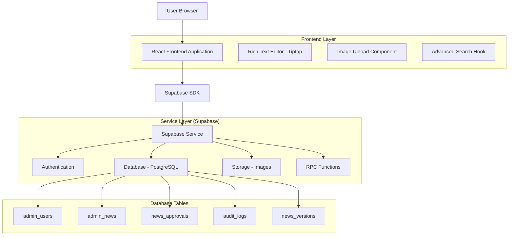
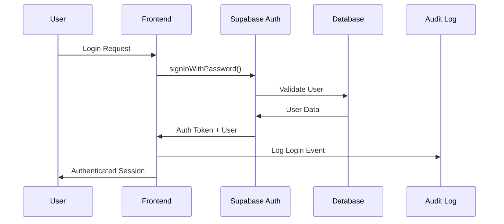
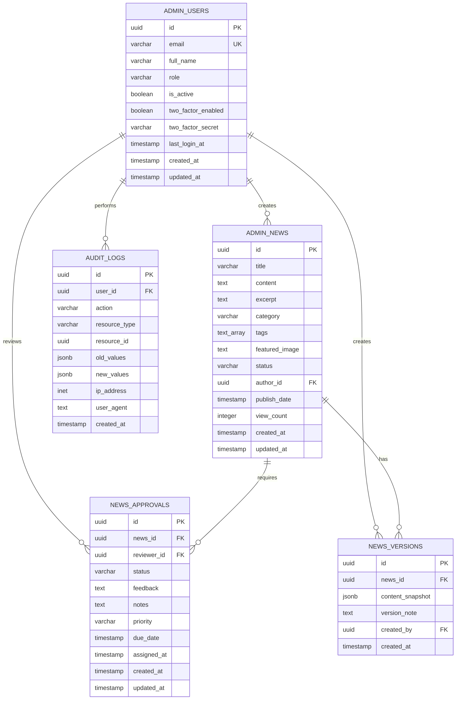

# Guia Técnico de Implementação - UbaNews

## 1. Arquitetura da Solução

### 1.1 Diagrama de Arquitetura Atualizada



### 1.2 Fluxo de Dados de Segurança



---

## 2. Estrutura de Banco de Dados Completa

### 2.1 Modelo de Dados Atualizado



### 2.2 Índices de Performance

```sql
-- Índices para busca de texto completo
CREATE INDEX idx_admin_news_fulltext ON admin_news 
USING gin(to_tsvector('portuguese', title || ' ' || content));

-- Índices compostos para consultas frequentes
CREATE INDEX idx_admin_news_status_date ON admin_news(status, publish_date DESC);
CREATE INDEX idx_admin_news_category_status ON admin_news(category, status);
CREATE INDEX idx_admin_news_author_status ON admin_news(author_id, status);

-- Índices para auditoria
CREATE INDEX idx_audit_logs_user_action ON audit_logs(user_id, action);
CREATE INDEX idx_audit_logs_resource ON audit_logs(resource_type, resource_id);
CREATE INDEX idx_audit_logs_date_range ON audit_logs(created_at DESC);

-- Índices para aprovações
CREATE INDEX idx_news_approvals_status_priority ON news_approvals(status, priority);
CREATE INDEX idx_news_approvals_reviewer_status ON news_approvals(reviewer_id, status);
```

---

## 3. Implementação de Segurança Avançada

### 3.1 Políticas RLS Detalhadas

```sql
-- Política para visualização de notícias baseada em hierarquia
CREATE POLICY "Hierarchical news access" ON admin_news
    FOR SELECT USING (
        CASE 
            -- Admins veem tudo
            WHEN EXISTS (
                SELECT 1 FROM admin_users 
                WHERE id = auth.uid() AND role = 'admin' AND is_active = true
            ) THEN true
            -- Editores veem suas próprias + publicadas
            WHEN EXISTS (
                SELECT 1 FROM admin_users 
                WHERE id = auth.uid() AND role = 'editor' AND is_active = true
            ) THEN (author_id = auth.uid() OR status = 'published')
            -- Colunistas veem apenas suas próprias
            WHEN EXISTS (
                SELECT 1 FROM admin_users 
                WHERE id = auth.uid() AND role = 'columnist' AND is_active = true
            ) THEN author_id = auth.uid()
            ELSE false
        END
    );

-- Política para logs de auditoria (apenas admins)
CREATE POLICY "Admin only audit access" ON audit_logs
    FOR ALL USING (
        EXISTS (
            SELECT 1 FROM admin_users 
            WHERE id = auth.uid() AND role = 'admin' AND is_active = true
        )
    );
```

### 3.2 Funções de Segurança

```sql
-- Função para verificar permissões
CREATE OR REPLACE FUNCTION check_user_permission(
    required_role TEXT,
    user_id UUID DEFAULT auth.uid()
) RETURNS BOOLEAN AS $$
DECLARE
    user_role TEXT;
    user_active BOOLEAN;
BEGIN
    SELECT role, is_active INTO user_role, user_active
    FROM admin_users
    WHERE id = user_id;
    
    IF NOT FOUND OR NOT user_active THEN
        RETURN FALSE;
    END IF;
    
    RETURN CASE required_role
        WHEN 'admin' THEN user_role = 'admin'
        WHEN 'editor' THEN user_role IN ('admin', 'editor')
        WHEN 'columnist' THEN user_role IN ('admin', 'editor', 'columnist')
        ELSE FALSE
    END;
END;
$$ LANGUAGE plpgsql SECURITY DEFINER;

-- Função para hash de senhas (se necessário)
CREATE OR REPLACE FUNCTION hash_password(password TEXT)
RETURNS TEXT AS $$
BEGIN
    RETURN crypt(password, gen_salt('bf', 12));
END;
$$ LANGUAGE plpgsql SECURITY DEFINER;
```

---

## 4. Sistema de Busca Avançada

### 4.1 Configuração de Busca por Texto Completo

```sql
-- Configuração de dicionário português
CREATE TEXT SEARCH CONFIGURATION portuguese_news (COPY = portuguese);

-- Função de busca com ranking avançado
CREATE OR REPLACE FUNCTION advanced_news_search(
    search_query TEXT,
    filters JSONB DEFAULT '{}',
    sort_by TEXT DEFAULT 'relevance',
    limit_count INTEGER DEFAULT 20,
    offset_count INTEGER DEFAULT 0
) RETURNS TABLE (
    id UUID,
    title VARCHAR(500),
    excerpt TEXT,
    category VARCHAR(100),
    featured_image TEXT,
    publish_date TIMESTAMP WITH TIME ZONE,
    author_name VARCHAR(255),
    view_count INTEGER,
    relevance_score REAL,
    highlight TEXT
) AS $$
DECLARE
    ts_query tsquery;
    category_filter TEXT;
    status_filter TEXT;
    date_from_filter TIMESTAMP WITH TIME ZONE;
    date_to_filter TIMESTAMP WITH TIME ZONE;
BEGIN
    -- Preparar query de busca
    ts_query := plainto_tsquery('portuguese_news', search_query);
    
    -- Extrair filtros
    category_filter := filters->>'category';
    status_filter := COALESCE(filters->>'status', 'published');
    date_from_filter := (filters->>'date_from')::TIMESTAMP WITH TIME ZONE;
    date_to_filter := (filters->>'date_to')::TIMESTAMP WITH TIME ZONE;
    
    RETURN QUERY
    SELECT 
        n.id,
        n.title,
        n.excerpt,
        n.category,
        n.featured_image,
        n.publish_date,
        u.full_name as author_name,
        n.view_count,
        CASE 
            WHEN search_query = '' THEN 1.0
            ELSE ts_rank_cd(
                to_tsvector('portuguese_news', n.title || ' ' || n.content),
                ts_query,
                32 -- normalize by document length
            )
        END as relevance_score,
        CASE 
            WHEN search_query = '' THEN ''
            ELSE ts_headline(
                'portuguese_news',
                n.content,
                ts_query,
                'MaxWords=50, MinWords=20, ShortWord=3, HighlightAll=false'
            )
        END as highlight
    FROM admin_news n
    JOIN admin_users u ON n.author_id = u.id
    WHERE 
        (status_filter IS NULL OR n.status = status_filter)
        AND (category_filter IS NULL OR n.category = category_filter)
        AND (date_from_filter IS NULL OR n.publish_date >= date_from_filter)
        AND (date_to_filter IS NULL OR n.publish_date <= date_to_filter)
        AND (
            search_query = '' OR 
            to_tsvector('portuguese_news', n.title || ' ' || n.content) @@ ts_query
        )
    ORDER BY 
        CASE sort_by
            WHEN 'relevance' THEN 
                CASE WHEN search_query = '' THEN 0 ELSE relevance_score END
            WHEN 'date' THEN EXTRACT(EPOCH FROM n.publish_date)
            WHEN 'views' THEN n.view_count
            ELSE 0
        END DESC,
        n.publish_date DESC
    LIMIT limit_count
    OFFSET offset_count;
END;
$$ LANGUAGE plpgsql SECURITY DEFINER;
```

### 4.2 Hook de Busca Otimizado

```typescript
// src/hooks/useOptimizedSearch.ts
import { useState, useCallback, useMemo } from 'react';
import { supabase } from '../lib/supabase';
import { debounce } from 'lodash';

export interface SearchFilters {
  category?: string;
  status?: string;
  dateFrom?: string;
  dateTo?: string;
}

export interface SearchOptions {
  sortBy?: 'relevance' | 'date' | 'views';
  limit?: number;
  page?: number;
}

export const useOptimizedSearch = () => {
  const [results, setResults] = useState([]);
  const [loading, setLoading] = useState(false);
  const [error, setError] = useState<string | null>(null);
  const [totalResults, setTotalResults] = useState(0);
  const [searchHistory, setSearchHistory] = useState<string[]>([]);

  // Debounced search para evitar muitas requisições
  const debouncedSearch = useMemo(
    () => debounce(async (
      query: string,
      filters: SearchFilters,
      options: SearchOptions
    ) => {
      setLoading(true);
      setError(null);
      
      try {
        const offset = ((options.page || 1) - 1) * (options.limit || 20);
        
        const { data, error: searchError } = await supabase
          .rpc('advanced_news_search', {
            search_query: query,
            filters: filters,
            sort_by: options.sortBy || 'relevance',
            limit_count: options.limit || 20,
            offset_count: offset
          });
        
        if (searchError) throw searchError;
        
        setResults(data || []);
        setTotalResults(data?.length || 0);
        
        // Adicionar ao histórico se não estiver vazio
        if (query.trim() && !searchHistory.includes(query)) {
          setSearchHistory(prev => [query, ...prev.slice(0, 9)]); // Manter apenas 10
        }
        
      } catch (err) {
        setError(err instanceof Error ? err.message : 'Erro na busca');
        setResults([]);
      } finally {
        setLoading(false);
      }
    }, 300),
    [searchHistory]
  );

  const performSearch = useCallback((
    query: string,
    filters: SearchFilters = {},
    options: SearchOptions = {}
  ) => {
    debouncedSearch(query, filters, options);
  }, [debouncedSearch]);

  const clearSearch = useCallback(() => {
    setResults([]);
    setError(null);
    setTotalResults(0);
  }, []);

  return {
    results,
    loading,
    error,
    totalResults,
    searchHistory,
    performSearch,
    clearSearch
  };
};
```

---

## 5. Sistema de Upload e Gerenciamento de Mídia

### 5.1 Configuração do Storage

```sql
-- Políticas para o bucket de imagens
CREATE POLICY "Public read access" ON storage.objects
    FOR SELECT USING (bucket_id = 'images');

CREATE POLICY "Authenticated upload access" ON storage.objects
    FOR INSERT WITH CHECK (
        bucket_id = 'images' AND
        auth.role() = 'authenticated' AND
        (storage.foldername(name))[1] = 'news-images'
    );

CREATE POLICY "Owner delete access" ON storage.objects
    FOR DELETE USING (
        bucket_id = 'images' AND
        auth.uid()::text = (storage.foldername(name))[2]
    );
```

### 5.2 Componente de Upload Avançado

```typescript
// src/components/AdvancedImageUpload.tsx
import React, { useState, useCallback } from 'react';
import { useDropzone } from 'react-dropzone';
import { supabase } from '../lib/supabase';
import { Progress } from './ui/progress';
import { Button } from './ui/button';
import { X, Upload, Image as ImageIcon } from 'lucide-react';

interface AdvancedImageUploadProps {
  onUploadComplete: (url: string) => void;
  maxSize?: number; // em bytes
  acceptedTypes?: string[];
}

export const AdvancedImageUpload: React.FC<AdvancedImageUploadProps> = ({
  onUploadComplete,
  maxSize = 5 * 1024 * 1024, // 5MB
  acceptedTypes = ['image/jpeg', 'image/png', 'image/webp']
}) => {
  const [uploading, setUploading] = useState(false);
  const [progress, setProgress] = useState(0);
  const [preview, setPreview] = useState<string | null>(null);
  const [error, setError] = useState<string | null>(null);

  const uploadFile = useCallback(async (file: File) => {
    setUploading(true);
    setError(null);
    setProgress(0);
    
    try {
      // Validações
      if (!acceptedTypes.includes(file.type)) {
        throw new Error(`Tipo de arquivo não suportado. Use: ${acceptedTypes.join(', ')}`);
      }
      
      if (file.size > maxSize) {
        throw new Error(`Arquivo muito grande. Máximo: ${(maxSize / 1024 / 1024).toFixed(1)}MB`);
      }
      
      // Gerar nome único
      const fileExt = file.name.split('.').pop()?.toLowerCase();
      const fileName = `${Date.now()}-${Math.random().toString(36).substring(2)}.${fileExt}`;
      const filePath = `news-images/${fileName}`;
      
      // Simular progresso durante upload
      const progressInterval = setInterval(() => {
        setProgress(prev => Math.min(prev + 10, 90));
      }, 100);
      
      // Upload para Supabase
      const { data, error: uploadError } = await supabase.storage
        .from('images')
        .upload(filePath, file, {
          cacheControl: '3600',
          upsert: false
        });
      
      clearInterval(progressInterval);
      setProgress(100);
      
      if (uploadError) throw uploadError;
      
      // Obter URL pública
      const { data: { publicUrl } } = supabase.storage
        .from('images')
        .getPublicUrl(filePath);
      
      onUploadComplete(publicUrl);
      
    } catch (err) {
      setError(err instanceof Error ? err.message : 'Erro no upload');
    } finally {
      setUploading(false);
      setTimeout(() => setProgress(0), 1000);
    }
  }, [acceptedTypes, maxSize, onUploadComplete]);

  const { getRootProps, getInputProps, isDragActive } = useDropzone({
    onDrop: (acceptedFiles) => {
      const file = acceptedFiles[0];
      if (file) {
        setPreview(URL.createObjectURL(file));
        uploadFile(file);
      }
    },
    accept: {
      'image/*': acceptedTypes.map(type => `.${type.split('/')[1]}`)
    },
    maxFiles: 1,
    disabled: uploading
  });

  const clearPreview = () => {
    setPreview(null);
    setError(null);
  };

  return (
    <div className="space-y-4">
      <div
        {...getRootProps()}
        className={`
          border-2 border-dashed rounded-lg p-6 text-center cursor-pointer transition-colors
          ${isDragActive ? 'border-blue-400 bg-blue-50' : 'border-gray-300'}
          ${uploading ? 'opacity-50 cursor-not-allowed' : 'hover:border-gray-400'}
        `}
      >
        <input {...getInputProps()} />
        
        {preview ? (
          <div className="relative">
            
            <Button
              type="button"
              variant="outline"
              size="sm"
              className="absolute top-2 right-2"
              onClick={(e) => {
                e.stopPropagation();
                clearPreview();
              }}
            >
              <X className="h-4 w-4" />
            </Button>
          </div>
        ) : (
          <div className="space-y-2">
            <ImageIcon className="h-12 w-12 mx-auto text-gray-400" />
            <div>
              <p className="text-lg font-medium">
                {isDragActive ? 'Solte a imagem aqui' : 'Clique ou arraste uma imagem'}
              </p>
              <p className="text-sm text-gray-500">
                Máximo {(maxSize / 1024 / 1024).toFixed(1)}MB • {acceptedTypes.join(', ')}
              </p>
            </div>
          </div>
        )}
      </div>
      
      {uploading && (
        <div className="space-y-2">
          <Progress value={progress} className="w-full" />
          <p className="text-sm text-center text-gray-600">
            Enviando... {progress}%
          </p>
        </div>
      )}
      
      {error && (
        <div className="p-3 bg-red-50 border border-red-200 rounded-lg">
          <p className="text-sm text-red-600">{error}</p>
        </div>
      )}
    </div>
  );
};
```

---

## 6. Sistema de Auditoria e Logs

### 6.1 Hook de Auditoria

```typescript
// src/hooks/useAuditLog.ts
import { useCallback } from 'react';
import { supabase } from '../lib/supabase';

export type AuditAction = 
  | 'LOGIN' | 'LOGOUT'
  | 'NEWS_CREATE' | 'NEWS_UPDATE' | 'NEWS_DELETE' | 'NEWS_PUBLISH'
  | 'APPROVAL_START' | 'APPROVAL_APPROVE' | 'APPROVAL_REJECT'
  | 'USER_CREATE' | 'USER_UPDATE' | 'USER_DELETE';

export const useAuditLog = () => {
  const logAction = useCallback(async (
    action: AuditAction,
    resourceType: string,
    resourceId?: string,
    oldValues?: any,
    newValues?: any
  ) => {
    try {
      await supabase.rpc('create_audit_log', {
        p_user_id: (await supabase.auth.getUser()).data.user?.id,
        p_action: action,
        p_resource_type: resourceType,
        p_resource_id: resourceId || null,
        p_old_values: oldValues ? JSON.stringify(oldValues) : null,
        p_new_values: newValues ? JSON.stringify(newValues) : null
      });
    } catch (error) {
      console.error('Erro ao criar log de auditoria:', error);
    }
  }, []);

  const getAuditLogs = useCallback(async (
    filters: {
      userId?: string;
      action?: AuditAction;
      resourceType?: string;
      dateFrom?: string;
      dateTo?: string;
    } = {},
    limit: number = 50,
    offset: number = 0
  ) => {
    try {
      let query = supabase
        .from('audit_logs')
        .select(`
          *,
          admin_users!audit_logs_user_id_fkey(full_name, email)
        `)
        .order('created_at', { ascending: false })
        .range(offset, offset + limit - 1);

      if (filters.userId) {
        query = query.eq('user_id', filters.userId);
      }
      if (filters.action) {
        query = query.eq('action', filters.action);
      }
      if (filters.resourceType) {
        query = query.eq('resource_type', filters.resourceType);
      }
      if (filters.dateFrom) {
        query = query.gte('created_at', filters.dateFrom);
      }
      if (filters.dateTo) {
        query = query.lte('created_at', filters.dateTo);
      }

      const { data, error } = await query;
      
      if (error) throw error;
      
      return data || [];
    } catch (error) {
      console.error('Erro ao buscar logs de auditoria:', error);
      return [];
    }
  }, []);

  return {
    logAction,
    getAuditLogs
  };
};
```

---

## 7. Otimizações de Performance

### 7.1 Cache Strategy

```typescript
// src/lib/cache.ts
class CacheManager {
  private cache = new Map<string, { data: any; timestamp: number; ttl: number }>();
  
  set(key: string, data: any, ttlMinutes: number = 30) {
    this.cache.set(key, {
      data,
      timestamp: Date.now(),
      ttl: ttlMinutes * 60 * 1000
    });
  }
  
  get(key: string) {
    const item = this.cache.get(key);
    
    if (!item) return null;
    
    if (Date.now() - item.timestamp > item.ttl) {
      this.cache.delete(key);
      return null;
    }
    
    return item.data;
  }
  
  clear(pattern?: string) {
    if (pattern) {
      const regex = new RegExp(pattern);
      for (const key of this.cache.keys()) {
        if (regex.test(key)) {
          this.cache.delete(key);
        }
      }
    } else {
      this.cache.clear();
    }
  }
}

export const cacheManager = new CacheManager();
```

### 7.2 Hook de Dados com Cache

```typescript
// src/hooks/useCachedData.ts
import { useState, useEffect, useCallback } from 'react';
import { cacheManager } from '../lib/cache';

export const useCachedData = <T>(
  key: string,
  fetcher: () => Promise<T>,
  ttlMinutes: number = 30
) => {
  const [data, setData] = useState<T | null>(null);
  const [loading, setLoading] = useState(true);
  const [error, setError] = useState<string | null>(null);

  const fetchData = useCallback(async (forceRefresh = false) => {
    setLoading(true);
    setError(null);
    
    try {
      // Tentar cache primeiro
      if (!forceRefresh) {
        const cached = cacheManager.get(key);
        if (cached) {
          setData(cached);
          setLoading(false);
          return;
        }
      }
      
      // Buscar dados
      const result = await fetcher();
      
      // Salvar no cache
      cacheManager.set(key, result, ttlMinutes);
      setData(result);
      
    } catch (err) {
      setError(err instanceof Error ? err.message : 'Erro ao carregar dados');
    } finally {
      setLoading(false);
    }
  }, [key, fetcher, ttlMinutes]);

  useEffect(() => {
    fetchData();
  }, [fetchData]);

  const refresh = useCallback(() => {
    fetchData(true);
  }, [fetchData]);

  return {
    data,
    loading,
    error,
    refresh
  };
};
```

---

## 8. Testes Automatizados

### 8.1 Testes de Integração

```typescript
// src/__tests__/integration/auth.test.ts
import { describe, it, expect, beforeEach, afterEach } from 'vitest';
import { supabase } from '../../lib/supabase';

describe('Authentication Integration', () => {
  const testUser = {
    email: 'test@ubanews.com',
    password: 'test123456'
  };

  beforeEach(async () => {
    // Limpar sessão
    await supabase.auth.signOut();
  });

  afterEach(async () => {
    // Limpar após teste
    await supabase.auth.signOut();
  });

  it('should authenticate user successfully', async () => {
    const { data, error } = await supabase.auth.signInWithPassword(testUser);
    
    expect(error).toBeNull();
    expect(data.user).toBeDefined();
    expect(data.user?.email).toBe(testUser.email);
  });

  it('should fail with invalid credentials', async () => {
    const { data, error } = await supabase.auth.signInWithPassword({
      email: testUser.email,
      password: 'wrongpassword'
    });
    
    expect(error).toBeDefined();
    expect(data.user).toBeNull();
  });

  it('should sign out successfully', async () => {
    // Login primeiro
    await supabase.auth.signInWithPassword(testUser);
    
    // Logout
    const { error } = await supabase.auth.signOut();
    
    expect(error).toBeNull();
    
    // Verificar se não há usuário logado
    const { data: { user } } = await supabase.auth.getUser();
    expect(user).toBeNull();
  });
});
```

### 8.2 Testes de Performance

```typescript
// src/__tests__/performance/search.test.ts
import { describe, it, expect } from 'vitest';
import { supabase } from '../../lib/supabase';

describe('Search Performance', () => {
  it('should complete search within acceptable time', async () => {
    const startTime = Date.now();
    
    const { data, error } = await supabase.rpc('advanced_news_search', {
      search_query: 'ubatuba',
      filters: {},
      sort_by: 'relevance',
      limit_count: 20,
      offset_count: 0
    });
    
    const endTime = Date.now();
    const duration = endTime - startTime;
    
    expect(error).toBeNull();
    expect(duration).toBeLessThan(1000); // Menos de 1 segundo
    expect(Array.isArray(data)).toBe(true);
  });

  it('should handle large result sets efficiently', async () => {
    const startTime = Date.now();
    
    const { data, error } = await supabase.rpc('advanced_news_search', {
      search_query: '',
      filters: {},
      sort_by: 'date',
      limit_count: 100,
      offset_count: 0
    });
    
    const endTime = Date.now();
    const duration = endTime - startTime;
    
    expect(error).toBeNull();
    expect(duration).toBeLessThan(2000); // Menos de 2 segundos
    expect(data?.length).toBeLessThanOrEqual(100);
  });
});
```

---

## 9. Monitoramento e Métricas

### 9.1 Dashboard de Métricas

```sql
-- View para métricas em tempo real
CREATE OR REPLACE VIEW admin_metrics AS
SELECT 
    'news' as metric_type,
    'total' as metric_name,
    COUNT(*)::text as metric_value,
    NOW() as updated_at
FROM admin_news
UNION ALL
SELECT 
    'news' as metric_type,
    'published' as metric_name,
    COUNT(*)::text as metric_value,
    NOW() as updated_at
FROM admin_news WHERE status = 'published'
UNION ALL
SELECT 
    'news' as metric_type,
    'pending_approval' as metric_name,
    COUNT(*)::text as metric_value,
    NOW() as updated_at
FROM news_approvals WHERE status = 'pending'
UNION ALL
SELECT 
    'users' as metric_type,
    'active' as metric_name,
    COUNT(*)::text as metric_value,
    NOW() as updated_at
FROM admin_users WHERE is_active = true;

-- Conceder acesso
GRANT SELECT ON admin_metrics TO authenticated;
```

### 9.2 Hook de Métricas

```typescript
// src/hooks/useMetrics.ts
import { useState, useEffect } from 'react';
import { supabase } from '../lib/supabase';
import { useCachedData } from './useCachedData';

interface Metric {
  metric_type: string;
  metric_name: string;
  metric_value: string;
  updated_at: string;
}

export const useMetrics = () => {
  const { data: metrics, loading, error, refresh } = useCachedData<Metric[]>(
    'admin_metrics',
    async () => {
      const { data, error } = await supabase
        .from('admin_metrics')
        .select('*');
      
      if (error) throw error;
      return data || [];
    },
    5 // Cache por 5 minutos
  );

  const getMetric = (type: string, name: string): string => {
    const metric = metrics?.find(m => m.metric_type === type && m.metric_name === name);
    return metric?.metric_value || '0';
  };

  return {
    metrics,
    loading,
    error,
    refresh,
    getMetric
  };
};
```

---

## 10. Deployment e DevOps

### 10.1 Scripts de Deploy

```bash
#!/bin/bash
# deploy.sh

set -e

echo "🚀 Iniciando deploy do UbaNews..."

# 1. Instalar dependências
echo "📦 Instalando dependências..."
npm ci

# 2. Executar testes
echo "🧪 Executando testes..."
npm run test

# 3. Build da aplicação
echo "🔨 Construindo aplicação..."
npm run build

# 4. Aplicar migrações do banco
echo "🗄️ Aplicando migrações..."
supabase db push

# 5. Verificar saúde da aplicação
echo "🏥 Verificando saúde da aplicação..."
npm run health-check

echo "✅ Deploy concluído com sucesso!"
```

### 10.2 Health Check

```typescript
// src/utils/healthCheck.ts
import { supabase } from '../lib/supabase';

export const healthCheck = async (): Promise<{
  status: 'healthy' | 'unhealthy';
  checks: Record<string, boolean>;
  timestamp: string;
}> => {
  const checks: Record<string, boolean> = {};
  
  try {
    // Verificar conexão com Supabase
    const { error: dbError } = await supabase
      .from('admin_users')
      .select('count')
      .limit(1);
    checks.database = !dbError;
    
    // Verificar Storage
    const { data: buckets, error: storageError } = await supabase.storage.listBuckets();
    checks.storage = !storageError && buckets?.some(b => b.name === 'images');
    
    // Verificar funções RPC
    const { error: rpcError } = await supabase.rpc('get_news_categories');
    checks.rpc_functions = !rpcError;
    
    const allHealthy = Object.values(checks).every(Boolean);
    
    return {
      status: allHealthy ? 'healthy' : 'unhealthy',
      checks,
      timestamp: new Date().toISOString()
    };
    
  } catch (error) {
    return {
      status: 'unhealthy',
      checks: { error: false },
      timestamp: new Date().toISOString()
    };
  }
};
```

---

## 11. Conclusão

Este guia técnico fornece uma implementação completa e robusta para resolver todos os problemas críticos identificados no UbaNews. A arquitetura proposta é:

- **Segura**: Autenticação real, RLS, auditoria completa
- **Escalável**: Cache inteligente, consultas otimizadas, índices adequados
- **Funcional**: Busca avançada, editor rico, upload de mídia
- **Monitorável**: Métricas em tempo real, health checks, logs detalhados
- **Testável**: Cobertura de testes, CI/CD automatizado

**Próximos Passos**:
1. Implementar as migrações de banco de dados
2. Atualizar os componentes frontend
3. Configurar o ambiente de produção
4. Executar testes de carga
5. Monitorar métricas pós-deploy

**Estimativa de Implementação**: 15-20 dias
**Recursos Necessários**: 1 desenvolvedor full-stack sênior
**Impacto Esperado**: Sistema production-ready com alta disponibilidade e performance