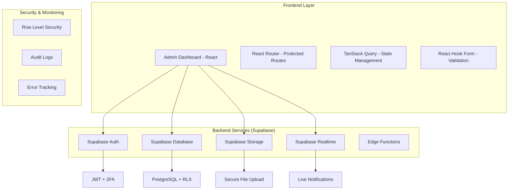
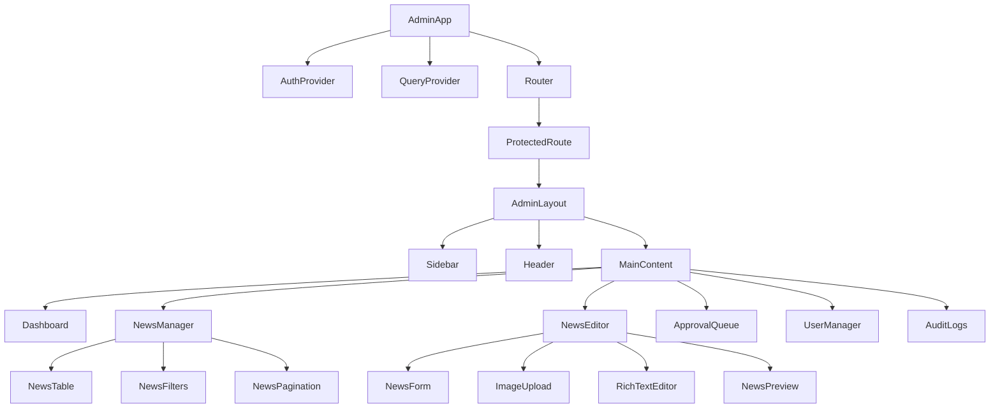
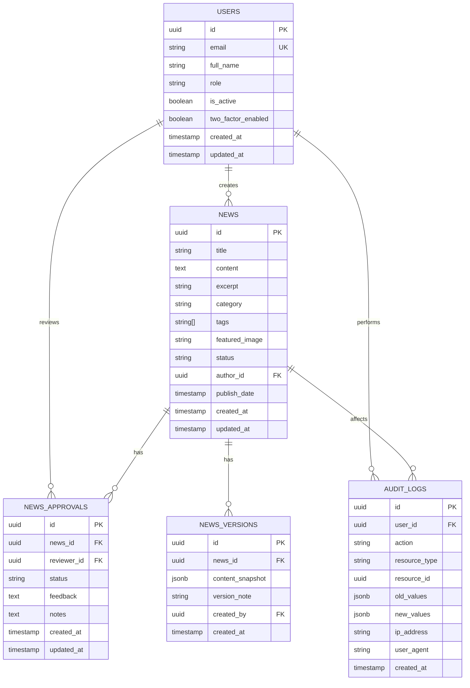

# Arquitetura Técnica - Sistema de Administração UbaNews

## 1. Arquitetura do Sistema



## 2. Stack Tecnológico

- **Frontend**: React 18 + TypeScript + Tailwind CSS + Vite
- **Backend**: Supabase (PostgreSQL + Auth + Storage + Realtime)
- **Validação**: Zod + React Hook Form
- **Estado**: TanStack Query + Zustand
- **Roteamento**: React Router v6 com rotas protegidas
- **UI Components**: Shadcn/ui + Lucide React
- **Monitoramento**: Sentry + LogRocket

## 3. Estrutura de Rotas

| Rota | Propósito | Proteção |
|------|-----------|----------|
| /admin | Dashboard principal | Admin/Editor |
| /admin/login | Página de login com 2FA | Público |
| /admin/news | Gerenciador de notícias | Admin/Editor/Colunista |
| /admin/news/create | Criar nova notícia | Admin/Editor/Colunista |
| /admin/news/edit/:id | Editar notícia específica | Admin/Editor/Proprietário |
| /admin/news/preview/:id | Preview da notícia | Admin/Editor/Colunista |
| /admin/approval | Fila de aprovação | Admin/Editor |
| /admin/users | Gerenciamento de usuários | Admin |
| /admin/audit | Logs e auditoria | Admin |
| /admin/settings | Configurações do sistema | Admin |

## 4. APIs e Endpoints

### 4.1 Autenticação

**Login com 2FA**
```
POST /auth/v1/token
```

Request:
| Campo | Tipo | Obrigatório | Descrição |
|-------|------|-------------|----------|
| email | string | true | Email do usuário |
| password | string | true | Senha do usuário |
| totp_code | string | false | Código 2FA (se habilitado) |

Response:
| Campo | Tipo | Descrição |
|-------|------|----------|
| access_token | string | JWT token de acesso |
| refresh_token | string | Token para renovação |
| user | object | Dados do usuário autenticado |

Exemplo:
```json
{
  "email": "admin@ubanews.com",
  "password": "SecurePass123!",
  "totp_code": "123456"
}
```

### 4.2 Gerenciamento de Notícias

**Listar Notícias**
```
GET /rest/v1/news
```

Query Parameters:
| Parâmetro | Tipo | Descrição |
|-----------|------|----------|
| status | string | Filtrar por status (draft, published, archived) |
| author_id | uuid | Filtrar por autor |
| category | string | Filtrar por categoria |
| search | string | Busca por título ou conteúdo |
| page | number | Número da página (padrão: 1) |
| limit | number | Itens por página (padrão: 20) |

**Criar Notícia**
```
POST /rest/v1/news
```

Request:
| Campo | Tipo | Obrigatório | Descrição |
|-------|------|-------------|----------|
| title | string | true | Título da notícia |
| content | string | true | Conteúdo em HTML |
| excerpt | string | true | Resumo da notícia |
| category | string | true | Categoria da notícia |
| tags | array | false | Array de tags |
| featured_image | string | false | URL da imagem destacada |
| status | string | true | Status (draft, published, archived) |
| publish_date | timestamp | false | Data de publicação |

### 4.3 Sistema de Aprovação

**Submeter para Aprovação**
```
POST /rest/v1/news_approvals
```

Request:
| Campo | Tipo | Obrigatório | Descrição |
|-------|------|-------------|----------|
| news_id | uuid | true | ID da notícia |
| reviewer_id | uuid | false | ID do revisor (opcional) |
| notes | string | false | Notas para o revisor |

**Aprovar/Rejeitar**
```
PATCH /rest/v1/news_approvals/:id
```

Request:
| Campo | Tipo | Obrigatório | Descrição |
|-------|------|-------------|----------|
| status | string | true | approved, rejected |
| feedback | string | false | Comentários do revisor |

## 5. Arquitetura de Componentes



## 6. Modelo de Dados

### 6.1 Diagrama de Entidades



### 6.2 Scripts de Criação das Tabelas

**Tabela de Usuários**
```sql
-- Criar tabela de usuários administrativos
CREATE TABLE admin_users (
    id UUID PRIMARY KEY DEFAULT gen_random_uuid(),
    email VARCHAR(255) UNIQUE NOT NULL,
    full_name VARCHAR(255) NOT NULL,
    role VARCHAR(50) NOT NULL CHECK (role IN ('admin', 'editor', 'columnist')),
    is_active BOOLEAN DEFAULT true,
    two_factor_enabled BOOLEAN DEFAULT false,
    two_factor_secret VARCHAR(255),
    last_login_at TIMESTAMP WITH TIME ZONE,
    created_at TIMESTAMP WITH TIME ZONE DEFAULT NOW(),
    updated_at TIMESTAMP WITH TIME ZONE DEFAULT NOW()
);

-- Índices para performance
CREATE INDEX idx_admin_users_email ON admin_users(email);
CREATE INDEX idx_admin_users_role ON admin_users(role);
CREATE INDEX idx_admin_users_active ON admin_users(is_active);

-- RLS (Row Level Security)
ALTER TABLE admin_users ENABLE ROW LEVEL SECURITY;

-- Política: Usuários podem ver apenas seus próprios dados
CREATE POLICY "Users can view own data" ON admin_users
    FOR SELECT USING (auth.uid() = id);

-- Política: Apenas admins podem ver todos os usuários
CREATE POLICY "Admins can view all users" ON admin_users
    FOR SELECT USING (
        EXISTS (
            SELECT 1 FROM admin_users 
            WHERE id = auth.uid() AND role = 'admin'
        )
    );
```

**Tabela de Notícias**
```sql
-- Criar tabela de notícias
CREATE TABLE admin_news (
    id UUID PRIMARY KEY DEFAULT gen_random_uuid(),
    title VARCHAR(500) NOT NULL,
    content TEXT NOT NULL,
    excerpt TEXT NOT NULL,
    category VARCHAR(100) NOT NULL,
    tags TEXT[] DEFAULT '{}',
    featured_image TEXT,
    status VARCHAR(20) NOT NULL DEFAULT 'draft' CHECK (status IN ('draft', 'pending', 'published', 'archived')),
    author_id UUID NOT NULL REFERENCES admin_users(id),
    publish_date TIMESTAMP WITH TIME ZONE,
    view_count INTEGER DEFAULT 0,
    created_at TIMESTAMP WITH TIME ZONE DEFAULT NOW(),
    updated_at TIMESTAMP WITH TIME ZONE DEFAULT NOW()
);

-- Índices para performance
CREATE INDEX idx_admin_news_status ON admin_news(status);
CREATE INDEX idx_admin_news_author ON admin_news(author_id);
CREATE INDEX idx_admin_news_category ON admin_news(category);
CREATE INDEX idx_admin_news_publish_date ON admin_news(publish_date DESC);
CREATE INDEX idx_admin_news_created_at ON admin_news(created_at DESC);

-- Índice para busca full-text
CREATE INDEX idx_admin_news_search ON admin_news USING gin(to_tsvector('portuguese', title || ' ' || content));

-- RLS (Row Level Security)
ALTER TABLE admin_news ENABLE ROW LEVEL SECURITY;

-- Política: Colunistas podem ver apenas suas próprias notícias
CREATE POLICY "Columnists can view own news" ON admin_news
    FOR SELECT USING (
        author_id = auth.uid() OR
        EXISTS (
            SELECT 1 FROM admin_users 
            WHERE id = auth.uid() AND role IN ('admin', 'editor')
        )
    );

-- Política: Todos podem inserir notícias
CREATE POLICY "All can insert news" ON admin_news
    FOR INSERT WITH CHECK (
        EXISTS (
            SELECT 1 FROM admin_users 
            WHERE id = auth.uid() AND is_active = true
        )
    );
```

**Tabela de Aprovações**
```sql
-- Criar tabela de aprovações
CREATE TABLE news_approvals (
    id UUID PRIMARY KEY DEFAULT gen_random_uuid(),
    news_id UUID NOT NULL REFERENCES admin_news(id) ON DELETE CASCADE,
    reviewer_id UUID REFERENCES admin_users(id),
    status VARCHAR(20) NOT NULL DEFAULT 'pending' CHECK (status IN ('pending', 'approved', 'rejected')),
    feedback TEXT,
    notes TEXT,
    created_at TIMESTAMP WITH TIME ZONE DEFAULT NOW(),
    updated_at TIMESTAMP WITH TIME ZONE DEFAULT NOW()
);

-- Índices
CREATE INDEX idx_news_approvals_news_id ON news_approvals(news_id);
CREATE INDEX idx_news_approvals_reviewer ON news_approvals(reviewer_id);
CREATE INDEX idx_news_approvals_status ON news_approvals(status);

-- RLS
ALTER TABLE news_approvals ENABLE ROW LEVEL SECURITY;

CREATE POLICY "Editors and admins can manage approvals" ON news_approvals
    FOR ALL USING (
        EXISTS (
            SELECT 1 FROM admin_users 
            WHERE id = auth.uid() AND role IN ('admin', 'editor')
        )
    );
```

**Tabela de Logs de Auditoria**
```sql
-- Criar tabela de logs de auditoria
CREATE TABLE audit_logs (
    id UUID PRIMARY KEY DEFAULT gen_random_uuid(),
    user_id UUID REFERENCES admin_users(id),
    action VARCHAR(100) NOT NULL,
    resource_type VARCHAR(50) NOT NULL,
    resource_id UUID,
    old_values JSONB,
    new_values JSONB,
    ip_address INET,
    user_agent TEXT,
    created_at TIMESTAMP WITH TIME ZONE DEFAULT NOW()
);

-- Índices para consultas eficientes
CREATE INDEX idx_audit_logs_user_id ON audit_logs(user_id);
CREATE INDEX idx_audit_logs_action ON audit_logs(action);
CREATE INDEX idx_audit_logs_resource ON audit_logs(resource_type, resource_id);
CREATE INDEX idx_audit_logs_created_at ON audit_logs(created_at DESC);

-- RLS - Apenas admins podem ver logs
ALTER TABLE audit_logs ENABLE ROW LEVEL SECURITY;

CREATE POLICY "Only admins can view audit logs" ON audit_logs
    FOR SELECT USING (
        EXISTS (
            SELECT 1 FROM admin_users 
            WHERE id = auth.uid() AND role = 'admin'
        )
    );
```

**Tabela de Versões**
```sql
-- Criar tabela de versões de notícias
CREATE TABLE news_versions (
    id UUID PRIMARY KEY DEFAULT gen_random_uuid(),
    news_id UUID NOT NULL REFERENCES admin_news(id) ON DELETE CASCADE,
    content_snapshot JSONB NOT NULL,
    version_note TEXT,
    created_by UUID NOT NULL REFERENCES admin_users(id),
    created_at TIMESTAMP WITH TIME ZONE DEFAULT NOW()
);

-- Índices
CREATE INDEX idx_news_versions_news_id ON news_versions(news_id);
CREATE INDEX idx_news_versions_created_at ON news_versions(created_at DESC);

-- RLS
ALTER TABLE news_versions ENABLE ROW LEVEL SECURITY;

CREATE POLICY "Users can view versions of accessible news" ON news_versions
    FOR SELECT USING (
        EXISTS (
            SELECT 1 FROM admin_news 
            WHERE id = news_id AND (
                author_id = auth.uid() OR
                EXISTS (
                    SELECT 1 FROM admin_users 
                    WHERE id = auth.uid() AND role IN ('admin', 'editor')
                )
            )
        )
    );
```

### 6.3 Funções e Triggers

**Trigger para Logs de Auditoria**
```sql
-- Função para criar logs de auditoria automaticamente
CREATE OR REPLACE FUNCTION create_audit_log()
RETURNS TRIGGER AS $$
BEGIN
    INSERT INTO audit_logs (
        user_id,
        action,
        resource_type,
        resource_id,
        old_values,
        new_values,
        ip_address
    ) VALUES (
        auth.uid(),
        TG_OP,
        TG_TABLE_NAME,
        COALESCE(NEW.id, OLD.id),
        CASE WHEN TG_OP = 'DELETE' THEN to_jsonb(OLD) ELSE NULL END,
        CASE WHEN TG_OP IN ('INSERT', 'UPDATE') THEN to_jsonb(NEW) ELSE NULL END,
        inet_client_addr()
    );
    
    RETURN COALESCE(NEW, OLD);
END;
$$ LANGUAGE plpgsql SECURITY DEFINER;

-- Aplicar trigger nas tabelas importantes
CREATE TRIGGER audit_admin_news
    AFTER INSERT OR UPDATE OR DELETE ON admin_news
    FOR EACH ROW EXECUTE FUNCTION create_audit_log();

CREATE TRIGGER audit_admin_users
    AFTER INSERT OR UPDATE OR DELETE ON admin_users
    FOR EACH ROW EXECUTE FUNCTION create_audit_log();
```

**Função para Criar Versões**
```sql
-- Função para criar versão automaticamente ao editar notícia
CREATE OR REPLACE FUNCTION create_news_version()
RETURNS TRIGGER AS $$
BEGIN
    -- Só criar versão se houve mudança no conteúdo
    IF OLD.title != NEW.title OR OLD.content != NEW.content OR OLD.excerpt != NEW.excerpt THEN
        INSERT INTO news_versions (
            news_id,
            content_snapshot,
            version_note,
            created_by
        ) VALUES (
            OLD.id,
            jsonb_build_object(
                'title', OLD.title,
                'content', OLD.content,
                'excerpt', OLD.excerpt,
                'category', OLD.category,
                'tags', OLD.tags,
                'featured_image', OLD.featured_image
            ),
            'Versão automática antes da edição',
            auth.uid()
        );
    END IF;
    
    RETURN NEW;
END;
$$ LANGUAGE plpgsql SECURITY DEFINER;

CREATE TRIGGER create_news_version_trigger
    BEFORE UPDATE ON admin_news
    FOR EACH ROW EXECUTE FUNCTION create_news_version();
```

## 7. Configuração de Segurança

### 7.1 Políticas RLS Avançadas

```sql
-- Política para permitir que colunistas vejam apenas suas notícias em rascunho
CREATE POLICY "Columnists draft access" ON admin_news
    FOR ALL USING (
        CASE 
            WHEN EXISTS (SELECT 1 FROM admin_users WHERE id = auth.uid() AND role = 'admin') THEN true
            WHEN EXISTS (SELECT 1 FROM admin_users WHERE id = auth.uid() AND role = 'editor') THEN true
            WHEN author_id = auth.uid() THEN true
            ELSE false
        END
    );

-- Política para publicação (apenas admins e editores)
CREATE POLICY "Only admins and editors can publish" ON admin_news
    FOR UPDATE USING (
        EXISTS (
            SELECT 1 FROM admin_users 
            WHERE id = auth.uid() AND role IN ('admin', 'editor')
        )
    )
    WITH CHECK (
        CASE 
            WHEN NEW.status = 'published' THEN 
                EXISTS (
                    SELECT 1 FROM admin_users 
                    WHERE id = auth.uid() AND role IN ('admin', 'editor')
                )
            ELSE true
        END
    );
```

### 7.2 Funções de Validação

```sql
-- Função para validar dados de notícia
CREATE OR REPLACE FUNCTION validate_news_data()
RETURNS TRIGGER AS $$
BEGIN
    -- Validar título
    IF LENGTH(TRIM(NEW.title)) < 10 THEN
        RAISE EXCEPTION 'Título deve ter pelo menos 10 caracteres';
    END IF;
    
    -- Validar conteúdo
    IF LENGTH(TRIM(NEW.content)) < 100 THEN
        RAISE EXCEPTION 'Conteúdo deve ter pelo menos 100 caracteres';
    END IF;
    
    -- Validar categoria
    IF NEW.category NOT IN ('Política', 'Economia', 'Esportes', 'Cultura', 'Tecnologia', 'Saúde') THEN
        RAISE EXCEPTION 'Categoria inválida';
    END IF;
    
    -- Definir data de publicação se status for 'published'
    IF NEW.status = 'published' AND OLD.status != 'published' THEN
        NEW.publish_date = NOW();
    END IF;
    
    RETURN NEW;
END;
$$ LANGUAGE plpgsql;

CREATE TRIGGER validate_news_trigger
    BEFORE INSERT OR UPDATE ON admin_news
    FOR EACH ROW EXECUTE FUNCTION validate_news_data();
```

## 8. Configuração do Frontend

### 8.1 Estrutura de Pastas

```
src/admin/
├── components/
│   ├── auth/
│   │   ├── LoginForm.tsx
│   │   ├── TwoFactorSetup.tsx
│   │   └── ProtectedRoute.tsx
│   ├── layout/
│   │   ├── AdminLayout.tsx
│   │   ├── Sidebar.tsx
│   │   └── Header.tsx
│   ├── news/
│   │   ├── NewsTable.tsx
│   │   ├── NewsForm.tsx
│   │   ├── NewsEditor.tsx
│   │   ├── NewsPreview.tsx
│   │   └── NewsFilters.tsx
│   ├── approval/
│   │   ├── ApprovalQueue.tsx
│   │   ├── ApprovalCard.tsx
│   │   └── ReviewModal.tsx
│   ├── users/
│   │   ├── UserTable.tsx
│   │   ├── UserForm.tsx
│   │   └── UserPermissions.tsx
│   └── audit/
│       ├── AuditTable.tsx
│       ├── AuditFilters.tsx
│       └── AuditExport.tsx
├── hooks/
│   ├── useAuth.ts
│   ├── useNews.ts
│   ├── useApprovals.ts
│   └── useAudit.ts
├── pages/
│   ├── Dashboard.tsx
│   ├── NewsManager.tsx
│   ├── ApprovalQueue.tsx
│   ├── UserManager.tsx
│   └── AuditLogs.tsx
├── types/
│   ├── auth.ts
│   ├── news.ts
│   └── audit.ts
└── utils/
    ├── supabase.ts
    ├── validation.ts
    └── permissions.ts
```

### 8.2 Configuração do Supabase

```typescript
// src/admin/utils/supabase.ts
import { createClient } from '@supabase/supabase-js'
import { Database } from '../types/database'

const supabaseUrl = process.env.VITE_SUPABASE_URL!
const supabaseAnonKey = process.env.VITE_SUPABASE_ANON_KEY!

export const supabase = createClient<Database>(supabaseUrl, supabaseAnonKey, {
  auth: {
    autoRefreshToken: true,
    persistSession: true,
    detectSessionInUrl: true
  },
  realtime: {
    params: {
      eventsPerSecond: 10
    }
  }
})

// Configurar interceptador para logs de auditoria
supabase.auth.onAuthStateChange((event, session) => {
  if (event === 'SIGNED_IN' && session) {
    // Log de login
    supabase.from('audit_logs').insert({
      action: 'LOGIN',
      resource_type: 'auth',
      ip_address: 'client_ip' // Será preenchido pelo trigger
    })
  }
})
```

## 9. Implementação de Segurança

### 9.1 Middleware de Autenticação

```typescript
// src/admin/utils/auth.ts
import { supabase } from './supabase'
import { AdminUser, UserRole } from '../types/auth'

export class AuthService {
  static async getCurrentUser(): Promise<AdminUser | null> {
    const { data: { user } } = await supabase.auth.getUser()
    if (!user) return null
    
    const { data: adminUser } = await supabase
      .from('admin_users')
      .select('*')
      .eq('id', user.id)
      .single()
    
    return adminUser
  }
  
  static async hasPermission(action: string, resource: string): Promise<boolean> {
    const user = await this.getCurrentUser()
    if (!user || !user.is_active) return false
    
    // Lógica de permissões baseada no role
    const permissions = {
      admin: ['*'],
      editor: ['news:*', 'approval:*'],
      columnist: ['news:create', 'news:edit_own']
    }
    
    const userPermissions = permissions[user.role as UserRole] || []
    return userPermissions.includes('*') || 
           userPermissions.includes(`${resource}:*`) ||
           userPermissions.includes(`${resource}:${action}`)
  }
  
  static async enableTwoFactor(secret: string, token: string): Promise<boolean> {
    // Implementar verificação TOTP
    const isValid = await this.verifyTOTP(secret, token)
    if (!isValid) return false
    
    const user = await this.getCurrentUser()
    if (!user) return false
    
    await supabase
      .from('admin_users')
      .update({ 
        two_factor_enabled: true,
        two_factor_secret: secret 
      })
      .eq('id', user.id)
    
    return true
  }
  
  private static async verifyTOTP(secret: string, token: string): Promise<boolean> {
    // Implementar verificação TOTP usando biblioteca como 'otplib'
    return true // Placeholder
  }
}
```

### 9.2 Hook de Autenticação

```typescript
// src/admin/hooks/useAuth.ts
import { useState, useEffect, createContext, useContext } from 'react'
import { AuthService } from '../utils/auth'
import { AdminUser } from '../types/auth'

interface AuthContextType {
  user: AdminUser | null
  loading: boolean
  login: (email: string, password: string, totpCode?: string) => Promise<boolean>
  logout: () => Promise<void>
  hasPermission: (action: string, resource: string) => Promise<boolean>
}

const AuthContext = createContext<AuthContextType | null>(null)

export const useAuth = () => {
  const context = useContext(AuthContext)
  if (!context) {
    throw new Error('useAuth must be used within AuthProvider')
  }
  return context
}

export const AuthProvider: React.FC<{ children: React.ReactNode }> = ({ children }) => {
  const [user, setUser] = useState<AdminUser | null>(null)
  const [loading, setLoading] = useState(true)
  
  useEffect(() => {
    checkUser()
  }, [])
  
  const checkUser = async () => {
    try {
      const currentUser = await AuthService.getCurrentUser()
      setUser(currentUser)
    } catch (error) {
      console.error('Error checking user:', error)
    } finally {
      setLoading(false)
    }
  }
  
  const login = async (email: string, password: string, totpCode?: string): Promise<boolean> => {
    try {
      const { error } = await supabase.auth.signInWithPassword({
        email,
        password
      })
      
      if (error) throw error
      
      // Verificar 2FA se necessário
      const currentUser = await AuthService.getCurrentUser()
      if (currentUser?.two_factor_enabled && !totpCode) {
        throw new Error('2FA_REQUIRED')
      }
      
      if (currentUser?.two_factor_enabled && totpCode) {
        const isValidTOTP = await AuthService.verifyTOTP(currentUser.two_factor_secret!, totpCode)
        if (!isValidTOTP) {
          throw new Error('INVALID_2FA')
        }
      }
      
      setUser(currentUser)
      return true
    } catch (error) {
      console.error('Login error:', error)
      return false
    }
  }
  
  const logout = async () => {
    await supabase.auth.signOut()
    setUser(null)
  }
  
  const hasPermission = async (action: string, resource: string): Promise<boolean> => {
    return AuthService.hasPermission(action, resource)
  }
  
  return (
    <AuthContext.Provider value={{
      user,
      loading,
      login,
      logout,
      hasPermission
    }}>
      {children}
    </AuthContext.Provider>
  )
}
```

## 10. Monitoramento e Logs

### 10.1 Sistema de Auditoria

```typescript
// src/admin/utils/audit.ts
import { supabase } from './supabase'

export class AuditService {
  static async logAction(
    action: string,
    resourceType: string,
    resourceId?: string,
    oldValues?: any,
    newValues?: any
  ) {
    try {
      await supabase.from('audit_logs').insert({
        action,
        resource_type: resourceType,
        resource_id: resourceId,
        old_values: oldValues,
        new_values: newValues
      })
    } catch (error) {
      console.error('Error logging audit action:', error)
    }
  }
  
  static async getAuditLogs(filters: {
    userId?: string
    action?: string
    resourceType?: string
    startDate?: Date
    endDate?: Date
    page?: number
    limit?: number
  }) {
    let query = supabase
      .from('audit_logs')
      .select(`
        *,
        admin_users!inner(full_name, email)
      `)
      .order('created_at', { ascending: false })
    
    if (filters.userId) {
      query = query.eq('user_id', filters.userId)
    }
    
    if (filters.action) {
      query = query.eq('action', filters.action)
    }
    
    if (filters.resourceType) {
      query = query.eq('resource_type', filters.resourceType)
    }
    
    if (filters.startDate) {
      query = query.gte('created_at', filters.startDate.toISOString())
    }
    
    if (filters.endDate) {
      query = query.lte('created_at', filters.endDate.toISOString())
    }
    
    const page = filters.page || 1
    const limit = filters.limit || 50
    const offset = (page - 1) * limit
    
    query = query.range(offset, offset + limit - 1)
    
    return query
  }
  
  static async exportAuditLogs(filters: any): Promise<Blob> {
    const { data } = await this.getAuditLogs({ ...filters, limit: 10000 })
    
    const csv = this.convertToCSV(data || [])
    return new Blob([csv], { type: 'text/csv' })
  }
  
  private static convertToCSV(data: any[]): string {
    if (!data.length) return ''
    
    const headers = Object.keys(data[0])
    const csvContent = [
      headers.join(','),
      ...data.map(row => 
        headers.map(header => 
          JSON.stringify(row[header] || '')
        ).join(',')
      )
    ].join('\n')
    
    return csvContent
  }
}
```

Esta arquitetura técnica fornece uma base sólida para implementar o sistema de administração de notícias com todos os requisitos de segurança, funcionalidade e escalabilidade necessários.