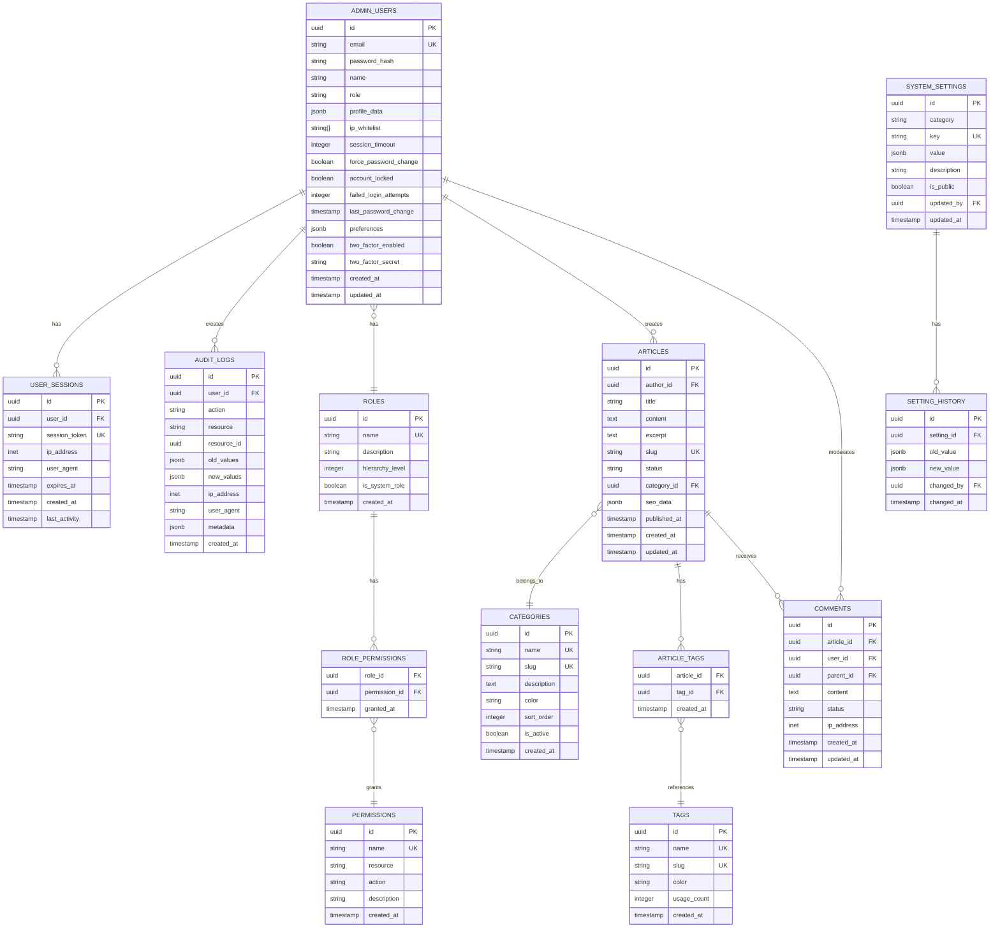

# Arquitetura Técnica - Sistema de Administração UbaNews

## 1. Arquitetura Geral do Sistema


## 2. Tecnologias e Dependências

### 2.1 Frontend Stack

* **React**: 18.2.0

* **TypeScript**: 5.0+

* **Vite**: 4.4+

* **Tailwind CSS**: 3.3+

* **shadcn/ui**: Latest

* **React Router**: 6.15+

* **React Hook Form**: 7.45+

* **Zod**: 3.22+ (validação)

* **Recharts**: 2.8+ (gráficos)

* **React Query**: 4.32+ (cache/sync)

* **Zustand**: 4.4+ (estado global)

### 2.2 Backend Services

* **Supabase**: Latest

* **PostgreSQL**: 15+

* **PostgREST**: Auto-generated API

* **GoTrue**: Authentication

* **Realtime**: WebSocket connections

### 2.3 Ferramentas de Desenvolvimento

* **ESLint**: Linting

* **Prettier**: Formatação

* **Jest**: Testes unitários

* **React Testing Library**: Testes de componentes

* **Cypress**: Testes E2E

* **Storybook**: Documentação de componentes

## 3. Estrutura de Rotas

### 3.1 Rotas Principais

| Rota                   | Componente      | Permissão Necessária | Descrição                     |
| ---------------------- | --------------- | -------------------- | ----------------------------- |
| `/admin`               | AdminLayout     | authenticated        | Layout principal do admin     |
| `/admin/dashboard`     | Dashboard       | admin.read           | Painel principal com métricas |
| `/admin/users`         | UserManagement  | users.manage         | Gerenciamento de usuários     |
| `/admin/users/:id`     | UserProfile     | users.read           | Perfil específico do usuário  |
| `/admin/news`          | NewsManagement  | news.manage          | Gerenciamento de notícias     |
| `/admin/news/create`   | NewsEditor      | news.create          | Criação de notícias           |
| `/admin/news/:id/edit` | NewsEditor      | news.update          | Edição de notícias            |
| `/admin/settings`      | SettingsManager | settings.manage      | Configurações do sistema      |
| `/admin/audit`         | AuditViewer     | audit.read           | Visualização de logs          |
| `/admin/reports`       | ReportsManager  | reports.read         | Relatórios e analytics        |

### 3.2 Proteção de Rotas

```typescript
// ProtectedRoute.tsx
interface ProtectedRouteProps {
  children: React.ReactNode
  requiredPermission?: string
  requiredRole?: string
  fallback?: React.ReactNode
}

const ProtectedRoute: React.FC<ProtectedRouteProps> = ({
  children,
  requiredPermission,
  requiredRole,
  fallback = <UnauthorizedPage />
}) => {
  const { user, hasPermission, hasRole } = useAuth()
  
  if (!user) {
    return <Navigate to="/admin/login" />
  }
  
  if (requiredPermission && !hasPermission(requiredPermission)) {
    return fallback
  }
  
  if (requiredRole && !hasRole(requiredRole)) {
    return fallback
  }
  
  return <>{children}</>
}
```

## 4. Definições de API

### 4.1 Autenticação

#### Login

```typescript
POST /auth/v1/token

// Request
interface LoginRequest {
  email: string
  password: string
  remember_me?: boolean
}

// Response
interface LoginResponse {
  access_token: string
  refresh_token: string
  expires_in: number
  user: {
    id: string
    email: string
    role: string
    permissions: string[]
  }
}
```

#### Verificação 2FA

```typescript
POST /auth/v1/verify

// Request
interface TwoFactorRequest {
  token: string
  code: string
}

// Response
interface TwoFactorResponse {
  verified: boolean
  access_token?: string
}
```

### 4.2 Gerenciamento de Usuários

#### Listar Usuários

```typescript
GET /rest/v1/admin_users

// Query Parameters
interface UserFilters {
  role?: string
  status?: 'active' | 'inactive' | 'locked'
  search?: string
  limit?: number
  offset?: number
  order_by?: string
  order_direction?: 'asc' | 'desc'
}

// Response
interface UsersResponse {
  data: AdminUser[]
  count: number
  total_pages: number
}
```

#### Criar Usuário

```typescript
POST /rest/v1/admin_users

// Request
interface CreateUserRequest {
  email: string
  password: string
  name: string
  role: string
  permissions?: string[]
  profile_data?: Record<string, any>
}

// Response
interface CreateUserResponse {
  id: string
  email: string
  name: string
  role: string
  created_at: string
}
```

### 4.3 Dashboard e Métricas

#### Métricas Gerais

```typescript
GET /rest/v1/rpc/get_dashboard_metrics

// Response
interface DashboardMetrics {
  users: {
    total: number
    active: number
    new_today: number
    growth_rate: number
  }
  content: {
    total_articles: number
    published_today: number
    pending_approval: number
    views_today: number
  }
  system: {
    uptime: number
    response_time: number
    error_rate: number
    storage_used: number
  }
}
```

#### Dados em Tempo Real

```typescript
// WebSocket Subscription
supabase
  .channel('dashboard-metrics')
  .on('postgres_changes', {
    event: '*',
    schema: 'public',
    table: 'articles'
  }, (payload) => {
    // Atualizar métricas em tempo real
  })
  .subscribe()
```

### 4.4 Sistema de Auditoria

#### Registrar Ação

```typescript
POST /rest/v1/audit_logs

// Request
interface AuditLogRequest {
  action: string
  resource: string
  resource_id?: string
  old_values?: Record<string, any>
  new_values?: Record<string, any>
  metadata?: Record<string, any>
}
```

#### Consultar Logs

```typescript
GET /rest/v1/audit_logs

// Query Parameters
interface AuditFilters {
  user_id?: string
  action?: string
  resource?: string
  date_from?: string
  date_to?: string
  limit?: number
  offset?: number
}
```

## 5. Modelo de Dados Detalhado

### 5.1 Diagrama ER



### 5.2 Definições DDL Completas

#### Tabela de Usuários Admin (Extensão)

```sql
-- Extensões necessárias
CREATE EXTENSION IF NOT EXISTS "uuid-ossp";
CREATE EXTENSION IF NOT EXISTS "pgcrypto";

-- Atualizar tabela existente
ALTER TABLE admin_users ADD COLUMN IF NOT EXISTS 
  ip_whitelist TEXT[],
  session_timeout INTEGER DEFAULT 3600,
  force_password_change BOOLEAN DEFAULT FALSE,
  account_locked BOOLEAN DEFAULT FALSE,
  failed_login_attempts INTEGER DEFAULT 0,
  last_password_change TIMESTAMP DEFAULT NOW(),
  preferences JSONB DEFAULT '{}',
  two_factor_enabled BOOLEAN DEFAULT FALSE,
  two_factor_secret TEXT;

-- Índices para performance
CREATE INDEX IF NOT EXISTS idx_admin_users_email ON admin_users(email);
CREATE INDEX IF NOT EXISTS idx_admin_users_role ON admin_users(role);
CREATE INDEX IF NOT EXISTS idx_admin_users_created_at ON admin_users(created_at);

-- Triggers para auditoria
CREATE OR REPLACE FUNCTION audit_admin_users_changes()
RETURNS TRIGGER AS $$
BEGIN
  INSERT INTO audit_logs (user_id, action, resource, resource_id, old_values, new_values)
  VALUES (
    auth.uid(),
    TG_OP,
    'admin_users',
    COALESCE(NEW.id, OLD.id),
    CASE WHEN TG_OP = 'DELETE' THEN to_jsonb(OLD) ELSE NULL END,
    CASE WHEN TG_OP = 'INSERT' OR TG_OP = 'UPDATE' THEN to_jsonb(NEW) ELSE NULL END
  );
  RETURN COALESCE(NEW, OLD);
END;
$$ LANGUAGE plpgsql SECURITY DEFINER;

CREATE TRIGGER audit_admin_users_trigger
  AFTER INSERT OR UPDATE OR DELETE ON admin_users
  FOR EACH ROW EXECUTE FUNCTION audit_admin_users_changes();
```

#### Sistema de Sessões

```sql
CREATE TABLE user_sessions (
  id UUID PRIMARY KEY DEFAULT gen_random_uuid(),
  user_id UUID REFERENCES admin_users(id) ON DELETE CASCADE,
  session_token TEXT UNIQUE NOT NULL,
  ip_address INET,
  user_agent TEXT,
  expires_at TIMESTAMP NOT NULL,
  created_at TIMESTAMP DEFAULT NOW(),
  last_activity TIMESTAMP DEFAULT NOW()
);

CREATE INDEX idx_user_sessions_token ON user_sessions(session_token);
CREATE INDEX idx_user_sessions_user_id ON user_sessions(user_id);
CREATE INDEX idx_user_sessions_expires_at ON user_sessions(expires_at);
```

#### Sistema de Permissões

```sql
CREATE TABLE roles (
  id UUID PRIMARY KEY DEFAULT gen_random_uuid(),
  name VARCHAR(50) UNIQUE NOT NULL,
  description TEXT,
  hierarchy_level INTEGER DEFAULT 0,
  is_system_role BOOLEAN DEFAULT FALSE,
  created_at TIMESTAMP DEFAULT NOW()
);

CREATE TABLE permissions (
  id UUID PRIMARY KEY DEFAULT gen_random_uuid(),
  name VARCHAR(100) UNIQUE NOT NULL,
  resource VARCHAR(50) NOT NULL,
  action VARCHAR(20) NOT NULL,
  description TEXT,
  created_at TIMESTAMP DEFAULT NOW()
);

CREATE TABLE role_permissions (
  role_id UUID REFERENCES roles(id) ON DELETE CASCADE,
  permission_id UUID REFERENCES permissions(id) ON DELETE CASCADE,
  granted_at TIMESTAMP DEFAULT NOW(),
  PRIMARY KEY (role_id, permission_id)
);

-- Índices
CREATE INDEX idx_role_permissions_role_id ON role_permissions(role_id);
CREATE INDEX idx_role_permissions_permission_id ON role_permissions(permission_id);
```

### 5.3 Funções do Banco de Dados

#### Verificação de Permissões

```sql
CREATE OR REPLACE FUNCTION check_user_permission(
  user_id UUID,
  resource TEXT,
  action TEXT
) RETURNS BOOLEAN AS $$
DECLARE
  user_role TEXT;
  has_permission BOOLEAN := FALSE;
BEGIN
  -- Buscar role do usuário
  SELECT role INTO user_role FROM admin_users WHERE id = user_id;
  
  -- Verificar se tem a permissão
  SELECT EXISTS(
    SELECT 1 FROM role_permissions rp
    JOIN permissions p ON rp.permission_id = p.id
    JOIN roles r ON rp.role_id = r.id
    WHERE r.name = user_role
    AND p.resource = check_user_permission.resource
    AND p.action = check_user_permission.action
  ) INTO has_permission;
  
  RETURN has_permission;
END;
$$ LANGUAGE plpgsql SECURITY DEFINER;
```

#### Métricas do Dashboard

```sql
CREATE OR REPLACE FUNCTION get_dashboard_metrics()
RETURNS JSON AS $$
DECLARE
  result JSON;
BEGIN
  SELECT json_build_object(
    'users', json_build_object(
      'total', (SELECT COUNT(*) FROM admin_users),
      'active', (SELECT COUNT(*) FROM admin_users WHERE account_locked = FALSE),
      'new_today', (SELECT COUNT(*) FROM admin_users WHERE created_at::date = CURRENT_DATE),
      'growth_rate', (
        SELECT CASE 
          WHEN COUNT(*) FILTER (WHERE created_at >= CURRENT_DATE - INTERVAL '7 days') = 0 THEN 0
          ELSE ROUND(
            (COUNT(*) FILTER (WHERE created_at >= CURRENT_DATE - INTERVAL '7 days')::float / 
             NULLIF(COUNT(*) FILTER (WHERE created_at >= CURRENT_DATE - INTERVAL '14 days' AND created_at < CURRENT_DATE - INTERVAL '7 days'), 0) - 1) * 100, 2
          )
        END
        FROM admin_users
      )
    ),
    'content', json_build_object(
      'total_articles', (SELECT COUNT(*) FROM articles),
      'published_today', (SELECT COUNT(*) FROM articles WHERE published_at::date = CURRENT_DATE),
      'pending_approval', (SELECT COUNT(*) FROM articles WHERE status = 'pending'),
      'views_today', COALESCE((SELECT SUM((metadata->>'views')::int) FROM articles WHERE updated_at::date = CURRENT_DATE), 0)
    ),
    'system', json_build_object(
      'uptime', EXTRACT(EPOCH FROM (NOW() - pg_postmaster_start_time())),
      'active_sessions', (SELECT COUNT(*) FROM user_sessions WHERE expires_at > NOW()),
      'storage_used', pg_database_size(current_database()),
      'error_rate', (
        SELECT COALESCE(
          ROUND(
            COUNT(*) FILTER (WHERE action LIKE '%error%')::float / 
            NULLIF(COUNT(*), 0) * 100, 2
          ), 0
        )
        FROM audit_logs 
        WHERE created_at >= CURRENT_DATE - INTERVAL '1 day'
      )
    )
  ) INTO result;
  
  RETURN result;
END;
$$ LANGUAGE plpgsql SECURITY DEFINER;
```

## 6. Políticas de Segurança (RLS)

### 6.1 Políticas para admin\_users

```sql
-- Habilitar RLS
ALTER TABLE admin_users ENABLE ROW LEVEL SECURITY;

-- Admins podem ver todos os usuários
CREATE POLICY "Admins can view all users" ON admin_users
  FOR SELECT USING (
    EXISTS (
      SELECT 1 FROM admin_users au 
      WHERE au.id = auth.uid() 
      AND au.role IN ('admin', 'super_admin')
    )
  );

-- Usuários podem ver apenas seu próprio perfil
CREATE POLICY "Users can view own profile" ON admin_users
  FOR SELECT USING (auth.uid() = id);

-- Apenas admins podem criar usuários
CREATE POLICY "Only admins can create users" ON admin_users
  FOR INSERT WITH CHECK (
    EXISTS (
      SELECT 1 FROM admin_users au 
      WHERE au.id = auth.uid() 
      AND au.role IN ('admin', 'super_admin')
    )
  );

-- Usuários podem atualizar próprio perfil, admins podem atualizar qualquer um
CREATE POLICY "Users can update own profile or admins can update any" ON admin_users
  FOR UPDATE USING (
    auth.uid() = id OR
    EXISTS (
      SELECT 1 FROM admin_users au 
      WHERE au.id = auth.uid() 
      AND au.role IN ('admin', 'super_admin')
    )
  );
```

### 6.2 Políticas para audit\_logs

```sql
ALTER TABLE audit_logs ENABLE ROW LEVEL SECURITY;

-- Apenas usuários com permissão de auditoria podem ver logs
CREATE POLICY "Audit permission required" ON audit_logs
  FOR SELECT USING (
    check_user_permission(auth.uid(), 'audit', 'read')
  );

-- Sistema pode inserir logs
CREATE POLICY "System can insert audit logs" ON audit_logs
  FOR INSERT WITH CHECK (true);
```

## 7. Arquitetura de Componentes Frontend

### 7.1 Estrutura de Pastas Detalhada

```
src/admin/
├── components/
│   ├── layout/
│   │   ├── AdminLayout.tsx
│   │   ├── Sidebar.tsx
│   │   ├── Header.tsx
│   │   ├── Breadcrumb.tsx
│   │   └── Footer.tsx
│   ├── auth/
│   │   ├── LoginForm.tsx
│   │   ├── TwoFactorAuth.tsx
│   │   ├── PasswordReset.tsx
│   │   ├── SessionTimeout.tsx
│   │   └── ProtectedRoute.tsx
│   ├── dashboard/
│   │   ├── Dashboard.tsx
│   │   ├── MetricCard.tsx
│   │   ├── RealtimeChart.tsx
│   │   ├── ActivityFeed.tsx
│   │   ├── QuickActions.tsx
│   │   └── SystemStatus.tsx
│   ├── users/
│   │   ├── UserManagement.tsx
│   │   ├── UserList.tsx
│   │   ├── UserForm.tsx
│   │   ├── UserProfile.tsx
│   │   ├── UserPermissions.tsx
│   │   └── UserActivity.tsx
│   ├── content/
│   │   ├── ArticleManagement.tsx
│   │   ├── ArticleEditor.tsx
│   │   ├── ArticleList.tsx
│   │   ├── CategoryManager.tsx
│   │   ├── TagManager.tsx
│   │   └── MediaLibrary.tsx
│   ├── settings/
│   │   ├── SettingsManager.tsx
│   │   ├── GeneralSettings.tsx
│   │   ├── SecuritySettings.tsx
│   │   ├── NotificationSettings.tsx
│   │   └── SystemSettings.tsx
│   ├── audit/
│   │   ├── AuditViewer.tsx
│   │   ├── AuditFilters.tsx
│   │   ├── AuditDetails.tsx
│   │   └── AuditExport.tsx
│   └── common/
│       ├── DataTable.tsx
│       ├── SearchInput.tsx
│       ├── FilterPanel.tsx
│       ├── ExportButton.tsx
│       ├── ConfirmDialog.tsx
│       └── LoadingSpinner.tsx
├── hooks/
│   ├── useAuth.ts
│   ├── usePermissions.ts
│   ├── useAuditLogger.ts
│   ├── useDashboard.ts
│   ├── useSettings.ts
│   ├── useRealtime.ts
│   └── useLocalStorage.ts
├── services/
│   ├── api/
│   │   ├── authApi.ts
│   │   ├── userApi.ts
│   │   ├── contentApi.ts
│   │   ├── auditApi.ts
│   │   └── settingsApi.ts
│   ├── supabase.ts
│   ├── websocket.ts
│   └── storage.ts
├── types/
│   ├── auth.ts
│   ├── user.ts
│   ├── content.ts
│   ├── audit.ts
│   ├── settings.ts
│   └── api.ts
├── utils/
│   ├── permissions.ts
│   ├── validation.ts
│   ├── formatting.ts
│   ├── constants.ts
│   ├── helpers.ts
│   └── dateUtils.ts
├── stores/
│   ├── authStore.ts
│   ├── userStore.ts
│   ├── settingsStore.ts
│   └── uiStore.ts
└── styles/
    ├── admin.css
    ├── components.css
    └── themes.css
```

## 8. Configurações de Segurança

### 8.1 Variáveis de Ambiente

```env
# Supabase
VITE_SUPABASE_URL=your_supabase_url
VITE_SUPABASE_ANON_KEY=your_supabase_anon_key
SUPABASE_SERVICE_ROLE_KEY=your_service_role_key

# Segurança
VITE_APP_ENV=production
VITE_ADMIN_DOMAIN=admin.ubanews.com
VITE_SESSION_TIMEOUT=3600
VITE_MAX_LOGIN_ATTEMPTS=5
VITE_PASSWORD_MIN_LENGTH=12

# Features
VITE_ENABLE_2FA=true
VITE_ENABLE_IP_WHITELIST=true
VITE_ENABLE_AUDIT_LOGS=true

# External Services
VITE_EMAIL_SERVICE_URL=your_email_service
VITE_ANALYTICS_ID=your_analytics_id
VITE_CDN_URL=your_cdn_url
```

### 8.2 Configuração de CORS

```typescript
// supabase/config.toml
[auth]
enable_signup = false
site_url = "https://admin.ubanews.com"
additional_redirect_urls = ["http://localhost:5173"]
jwt_expiry = 3600
refresh_token_rotation_enabled = true
security_update_password_require_reauthentication = true

[auth.external.email]
enabled = true
confirm_email_change_enabled = true
secure_email_change_enabled = true
```

## 9. Performance e Otimização

### 9.1 Estratégias de Cache

```typescript
// React Query configuration
const queryClient = new QueryClient({
  defaultOptions: {
    queries: {
      staleTime: 5 * 60 * 1000, // 5 minutos
      cacheTime: 10 * 60 * 1000, // 10 minutos
      refetchOnWindowFocus: false,
      retry: 3,
    },
  },
})

// Cache keys
export const QUERY_KEYS = {
  users: ['users'] as const,
  user: (id: string) => ['users', id] as const,
  dashboard: ['dashboard'] as const,
  settings: ['settings'] as const,
  audit: (filters: AuditFilters) => ['audit', filters] as const,
} as const
```

### 9.2 Lazy Loading

```typescript
// Lazy loading de rotas
const Dashboard = lazy(() => import('../components/dashboard/Dashboard'))
const UserManagement = lazy(() => import('../components/users/UserManagement'))
const SettingsManager = lazy(() => import('../components/settings/SettingsManager'))

// Lazy loading de componentes pesados
const ChartComponent = lazy(() => import('../components/charts/ChartComponent'))
const DataTable = lazy(() => import('../components/common/DataTable'))
```

## 10. Monitoramento e Logging

### 10.1 Métricas de Performance

```typescript
// Performance monitoring
const performanceMonitor = {
  trackPageLoad: (pageName: string) => {
    const startTime = performance.now()
    return () => {
      const endTime = performance.now()
      const loadTime = endTime - startTime
      
      // Enviar métrica para analytics
      analytics.track('page_load', {
        page: pageName,
        load_time: loadTime,
        timestamp: new Date().toISOString()
      })
    }
  },
  
  trackApiCall: (endpoint: string, method: string) => {
    const startTime = performance.now()
    return (success: boolean, statusCode?: number) => {
      const endTime = performance.now()
      const responseTime = endTime - startTime
      
      analytics.track('api_call', {
        endpoint,
        method,
        success,
        status_code: statusCode,
        response_time: responseTime,
        timestamp: new Date().toISOString()
      })
    }
  }
}
```

### 10.2 Error Boundary

```typescript
class AdminErrorBoundary extends React.Component<
  { children: React.ReactNode },
  { hasError: boolean; error?: Error }
> {
  constructor(props: { children: React.ReactNode }) {
    super(props)
    this.state = { hasError: false }
  }

  static getDerivedStateFromError(error: Error) {
    return { hasError: true, error }
  }

  componentDidCatch(error: Error, errorInfo: React.ErrorInfo) {
    // Log error to monitoring service
    console.error('Admin Error Boundary:', error, errorInfo)
    
    // Send to audit log
    auditLogger.logError(error, {
      component: 'AdminErrorBoundary',
      errorInfo,
      timestamp: new Date().toISOString()
    })
  }

  render() {
    if (this.state.hasError) {
      return (
        <div className="error-boundary">
          <h2>Algo deu errado</h2>
          <p>Ocorreu um erro inesperado. Nossa equipe foi notificada.</p>
          <button onClick={() => window.location.reload()}>
            Recarregar Página
          </button>
        </div>
      )
    }

    return this.props.children
  }
}
```

***

**Próximos Passos para Implementação:**

1. **Setup do Ambiente**: Configurar variáveis de ambiente e dependências
2. **Database Setup**: Executar scripts DDL e configurar RLS
3. **Componentes Base**: Implementar layout e autenticação
4. **Features Core**: Dashboard, usuários, configurações
5. **Testes**: Implementar testes unitários e E2E
6. **Deploy**: Configurar CI/CD e monitoramento

Esta arquitetura garante escalabilidade, segurança e manutenibilidade do sistema administrativo do UbaNews.

```
```

