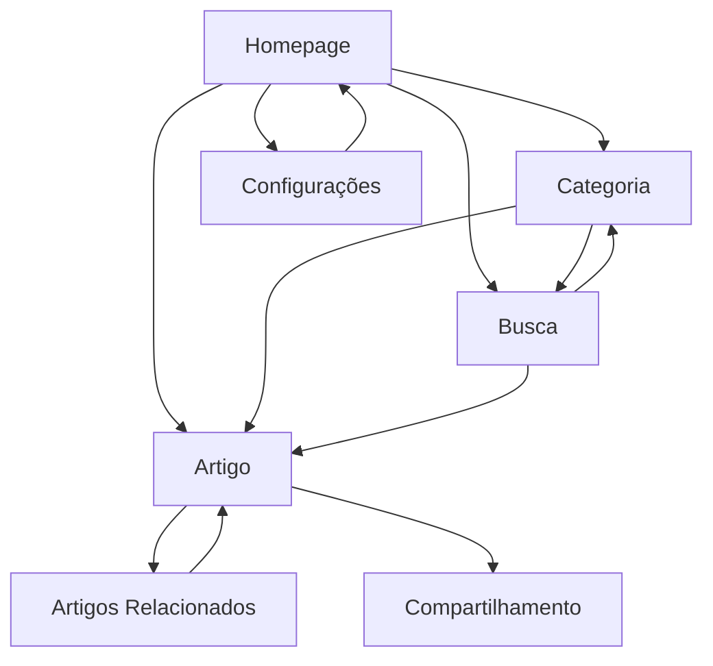

# Documento de Requisitos do Produto - Portal Ubatuba News Mobile-First

## 1. Visão Geral do Produto

Transformação do portal de notícias Ubatuba em uma experiência mobile-first otimizada, priorizando velocidade, usabilidade e engajamento em dispositivos móveis. O produto visa oferecer acesso rápido e intuitivo às notícias locais de Ubatuba, com foco em performance superior e experiência do usuário moderna.

O portal atenderá principalmente residentes e visitantes de Ubatuba que buscam informações locais atualizadas, com interface otimizada para consumo de conteúdo em smartphones e tablets.

## 2. Funcionalidades Principais

### 2.1 Papéis de Usuário

| Papel | Método de Acesso | Permissões Principais |
|-------|------------------|----------------------|
| Leitor Anônimo | Acesso direto ao portal | Visualizar notícias, buscar conteúdo, navegar categorias |
| Leitor Cadastrado | Registro por email/redes sociais | Personalizar preferências, salvar artigos, receber notificações |
| Administrador | Login administrativo | Gerenciar conteúdo, moderar comentários, acessar analytics |

### 2.2 Módulos de Funcionalidade

Nosso portal mobile-first consiste nas seguintes páginas principais:

1. **Homepage**: cabeçalho fixo com navegação, seção hero com destaque principal, grid de categorias, feed infinito de notícias
2. **Página de Categoria**: filtros por categoria, lista de artigos da categoria selecionada, navegação breadcrumb
3. **Página de Artigo**: conteúdo completo do artigo, galeria de imagens, botões de compartilhamento, artigos relacionados
4. **Página de Busca**: campo de busca avançada, filtros por data/categoria, resultados paginados
5. **Página de Configurações**: preferências de tema, configurações de notificação, gerenciamento de categorias favoritas

### 2.3 Detalhes das Páginas

| Nome da Página | Nome do Módulo | Descrição da Funcionalidade |
|----------------|----------------|-----------------------------|
| Homepage | Cabeçalho Fixo | Navegação hambúrguer, logo responsivo, busca simplificada, botão de tema |
| Homepage | Seção Hero | Carrossel de destaques principais com imagens otimizadas, títulos e resumos |
| Homepage | Grid de Categorias | Lista visual de categorias com ícones, cores personalizadas e contadores |
| Homepage | Feed de Notícias | Scroll infinito com lazy loading, cards responsivos, skeleton loading |
| Homepage | Rodapé Móvel | Links essenciais, redes sociais, newsletter signup compacto |
| Categoria | Filtros Avançados | Filtros por data, popularidade, bairro com interface touch-friendly |
| Categoria | Lista de Artigos | Cards otimizados para mobile com thumbnails, títulos, resumos e metadados |
| Artigo | Conteúdo Principal | Texto otimizado para leitura mobile, imagens responsivas, tipografia escalável |
| Artigo | Galeria de Mídia | Visualizador de imagens com gestos touch, zoom, navegação por swipe |
| Artigo | Ações Sociais | Botões de compartilhamento nativos, contador de visualizações, tempo de leitura |
| Artigo | Conteúdo Relacionado | Sugestões de artigos similares com base em categoria e tags |
| Busca | Campo de Busca | Busca com autocomplete, sugestões, histórico de pesquisas |
| Busca | Resultados | Lista de resultados com highlighting, filtros laterais colapsáveis |
| Configurações | Preferências de Tema | Toggle dark/light mode, seleção de cores de destaque, tamanho de fonte |
| Configurações | Notificações | Configuração de push notifications, preferências por categoria |

## 3. Fluxo Principal de Uso

### Fluxo do Leitor Anônimo
O usuário acessa a homepage → navega pelas categorias ou usa a busca → seleciona um artigo → lê o conteúdo → compartilha ou navega para artigos relacionados → retorna ao feed principal.

### Fluxo do Leitor Cadastrado
O usuário faz login → personaliza suas preferências → recebe conteúdo personalizado no feed → salva artigos de interesse → configura notificações → interage com conteúdo através de comentários e compartilhamentos.

### Fluxo de Navegação

## 4. Design da Interface do Usuário

### 4.1 Estilo de Design

**Cores Principais:**
- Primária: #0EA5E9 (Sky Blue) - para CTAs e elementos interativos
- Secundária: #64748B (Slate Gray) - para textos secundários
- Destaque: #F59E0B (Amber) - para categorias e badges
- Fundo Claro: #FFFFFF / Fundo Escuro: #0F172A

**Estilo de Botões:**
- Botões primários: cantos arredondados (8px), sombra sutil, área mínima de toque 48x48px
- Botões secundários: outline com hover states, transições suaves
- FABs (Floating Action Buttons): para ações principais como busca e compartilhamento

**Tipografia:**
- Fonte principal: Inter (system font fallback)
- Tamanhos: Título (24px), Subtítulo (18px), Corpo (16px), Caption (14px)
- Line-height otimizado para leitura mobile (1.6)

**Layout:**
- Design baseado em cards com espaçamento consistente (16px/24px)
- Navegação bottom-first com cabeçalho fixo
- Grid responsivo com breakpoints: 320px, 768px, 1024px

**Ícones e Animações:**
- Ícones Lucide React para consistência
- Micro-interações com React Spring
- Skeleton screens para estados de carregamento
- Transições suaves entre páginas (300ms ease-out)

### 4.2 Visão Geral do Design das Páginas

| Nome da Página | Nome do Módulo | Elementos da UI |
|----------------|----------------|------------------|
| Homepage | Cabeçalho Fixo | Fundo semi-transparente com blur, logo SVG otimizado, ícones touch-friendly, gradiente sutil |
| Homepage | Seção Hero | Background com overlay, imagem responsiva WebP/AVIF, texto com contraste 4.5:1, CTA destacado |
| Homepage | Grid de Categorias | Cards com ícones coloridos, hover states, badges de contagem, layout flexível |
| Homepage | Feed de Notícias | Cards com aspect ratio 16:9, thumbnails lazy-loaded, metadados organizados, separadores sutis |
| Categoria | Filtros | Chips selecionáveis, dropdown touch-friendly, clear states, animações de feedback |
| Artigo | Conteúdo | Tipografia otimizada, imagens full-width responsivas, progress bar de leitura |
| Artigo | Galeria | Modal fullscreen, gestos de pinch/zoom, indicadores de posição, botões de navegação |
| Busca | Interface | Input com ícone de busca, sugestões dropdown, histórico com clear option |
| Configurações | Controles | Toggles iOS-style, sliders para tamanho de fonte, color pickers, preview em tempo real |

### 4.3 Responsividade

**Abordagem Mobile-First:**
- Design inicial para 320px (iPhone SE)
- Breakpoints progressivos: 480px, 768px, 1024px, 1280px
- Imagens responsivas com srcset e sizes otimizados
- Touch targets mínimos de 44px (iOS) / 48px (Android)
- Navegação adaptativa: bottom navigation em mobile, sidebar em desktop

**Otimizações Touch:**
- Gestos de swipe para navegação entre artigos
- Pull-to-refresh no feed principal
- Scroll infinito com indicadores de carregamento
- Haptic feedback em dispositivos compatíveis

**Acessibilidade:**
- Contraste mínimo WCAG AA (4.5:1)
- Navegação por teclado completa
- Screen reader support com ARIA labels
- Focus indicators visíveis
- Texto alternativo para todas as imagens
- Suporte a modo de alto contraste do sistema

## 5. Requisitos Técnicos de Performance

### 5.1 Core Web Vitals

**Largest Contentful Paint (LCP):**
- Meta: < 2.5 segundos
- Estratégias: preload de imagens hero, otimização de fontes, CDN para assets

**First Input Delay (FID):**
- Meta: < 100 milissegundos
- Estratégias: code splitting, lazy loading de componentes, debounce em inputs

**Cumulative Layout Shift (CLS):**
- Meta: < 0.1
- Estratégias: dimensões fixas para imagens, skeleton screens, reserva de espaço para ads

### 5.2 Otimizações de Carregamento

**Imagens:**
- Formatos modernos: WebP/AVIF com fallback JPEG
- Lazy loading com Intersection Observer
- Responsive images com srcset
- Compressão automática baseada em device pixel ratio

**JavaScript:**
- Bundle splitting por rotas
- Tree shaking para remoção de código não utilizado
- Preload de rotas críticas
- Service Worker para cache estratégico

**CSS:**
- Critical CSS inline
- Purge de classes não utilizadas
- Minificação e compressão

**Fontes:**
- font-display: swap para evitar FOIT
- Preload de fontes críticas
- Subset de caracteres para português

### 5.3 Estratégias de Cache

**Service Worker:**
- Cache-first para assets estáticos
- Network-first para conteúdo dinâmico
- Stale-while-revalidate para imagens

**CDN:**
- Distribuição global de assets
- Compressão Brotli/Gzip
- HTTP/2 push para recursos críticos

## 6. Funcionalidades Mobile-Específicas

### 6.1 Progressive Web App (PWA)

**Instalabilidade:**
- Web App Manifest completo
- Service Worker para funcionamento offline
- Ícones adaptativos para diferentes plataformas

**Offline Support:**
- Cache de artigos lidos recentemente
- Modo offline com conteúdo em cache
- Sincronização em background quando online

### 6.2 Notificações Push

**Configuração:**
- Opt-in inteligente baseado em engajamento
- Segmentação por categorias de interesse
- Horários personalizáveis para não incomodar

**Tipos de Notificação:**
- Breaking news para notícias urgentes
- Resumo diário personalizado
- Notificações de artigos salvos

### 6.3 Integração com Sistema Operacional

**iOS:**
- Suporte a Safari Web Extensions
- Integração com Shortcuts app
- Suporte a modo escuro do sistema

**Android:**
- Trusted Web Activity (TWA) para app store
- Integração com Android Share Sheet
- Suporte a temas dinâmicos (Material You)

## 7. Métricas de Sucesso

### 7.1 Performance
- LCP < 2.5s em 75% das sessões
- FID < 100ms em 95% das interações
- CLS < 0.1 em 75% das sessões
- Tempo de carregamento inicial < 3s

### 7.2 Engajamento
- Tempo médio na página > 2 minutos
- Taxa de rejeição < 40%
- Páginas por sessão > 3
- Taxa de retorno de usuários > 60%

### 7.3 Usabilidade
- Taxa de conclusão de tarefas > 90%
- Satisfação do usuário (NPS) > 70
- Tempo para encontrar conteúdo < 30s
- Taxa de erro em formulários < 5%

### 7.4 Técnicas
- Uptime > 99.9%
- Cobertura de testes > 80%
- Bundle size < 200KB (gzipped)
- Lighthouse Score > 90 (Performance, Accessibility, Best Practices, SEO)

## 8. Cronograma de Implementação

### Fase 1 - Fundação (Semanas 1-2)
- Setup do ambiente de desenvolvimento
- Implementação da arquitetura base
- Componentes de design system
- Configuração de performance monitoring

### Fase 2 - Core Features (Semanas 3-4)
- Homepage com feed infinito
- Páginas de categoria e artigo
- Sistema de busca
- Navegação mobile otimizada

### Fase 3 - Otimizações (Semanas 5-6)
- Implementação de PWA
- Otimizações de performance
- Testes de usabilidade
- Ajustes de acessibilidade

### Fase 4 - Lançamento (Semanas 7-8)
- Testes finais de performance
- Deploy em produção
- Monitoramento de métricas
- Ajustes baseados em feedback

Este documento serve como guia completo para a transformação do portal Ubatuba News em uma experiência mobile-first de alta qualidade, priorizando performance, usabilidade e engajamento do usuário.