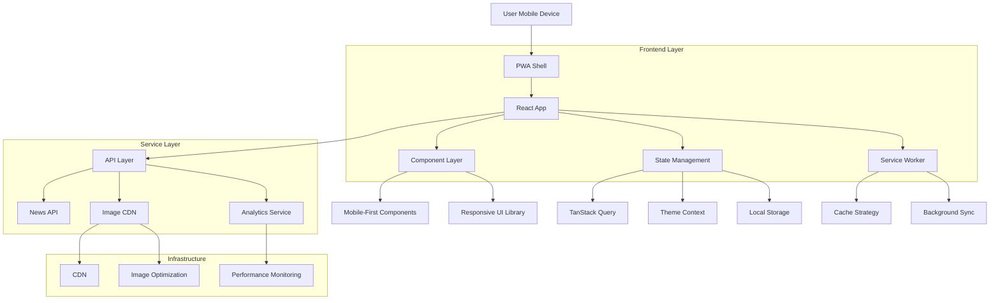
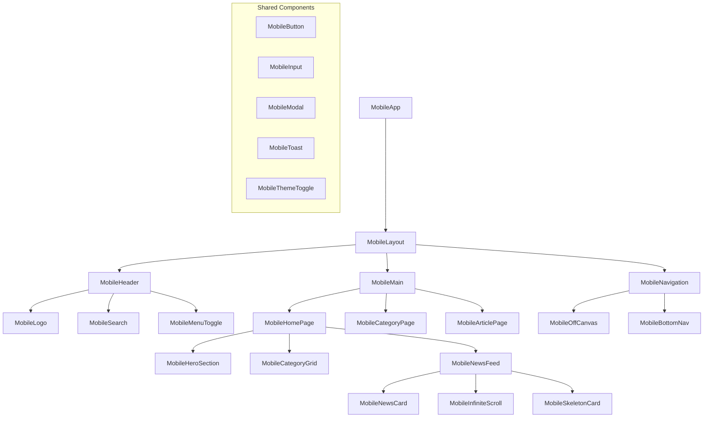
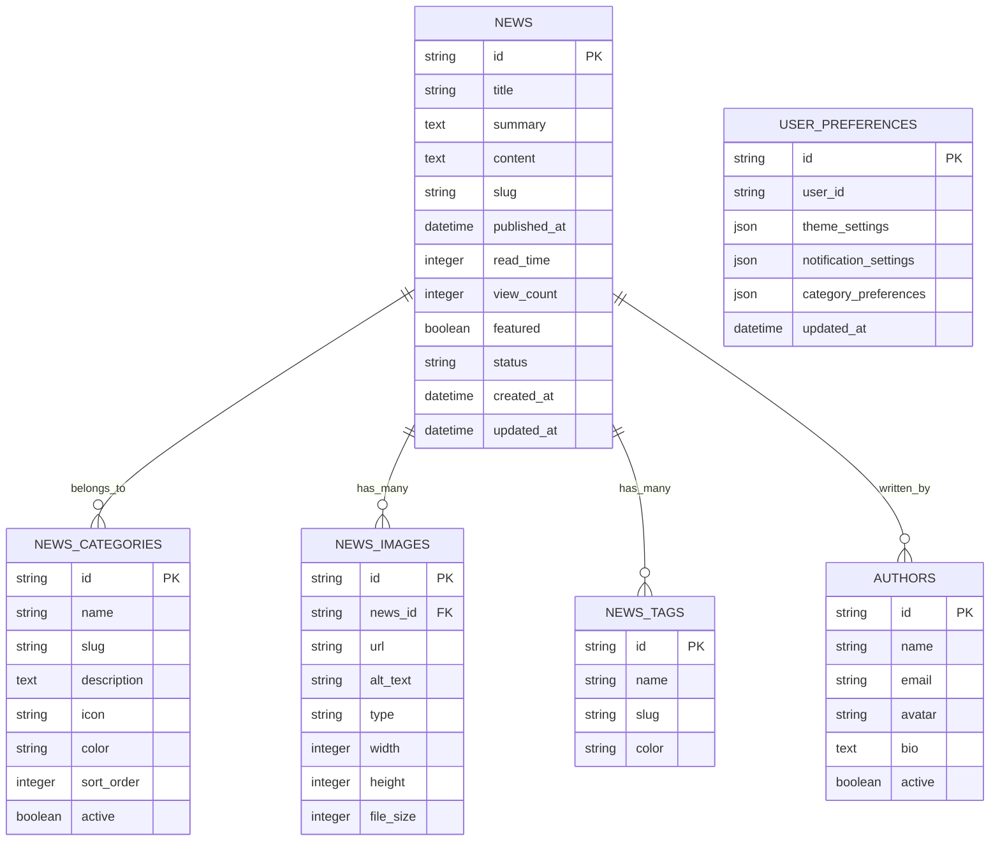

# Arquitetura Técnica Mobile-First - Portal Ubatuba News

## 1. Arquitetura do Sistema



## 2. Stack Tecnológico

### 2.1 Frontend Core
- **Framework**: React 18.3.1 + TypeScript
- **Build Tool**: Vite 5.4.19 com SWC
- **Styling**: Tailwind CSS 3.4+ com design system customizado
- **UI Components**: Radix UI + shadcn/ui (mobile-optimized)
- **State Management**: TanStack Query + Context API
- **Routing**: React Router DOM 6.30+

### 2.2 Performance & PWA
- **Service Worker**: Workbox para cache estratégico
- **Image Optimization**: Sharp + WebP/AVIF support
- **Bundle Optimization**: Vite code splitting + tree shaking
- **Lazy Loading**: Intersection Observer API
- **Web Vitals**: web-vitals library para monitoramento

### 2.3 Mobile-Specific
- **Touch Gestures**: React Spring para animações fluidas
- **Viewport Management**: Meta viewport otimizado
- **Offline Support**: Cache-first strategy para conteúdo crítico
- **Push Notifications**: Web Push API (futuro)

## 3. Definições de Rotas

| Rota | Propósito | Componente Mobile |
|------|-----------|-------------------|
| `/` | Homepage com feed principal | `MobileHomePage` |
| `/categoria/:slug` | Listagem por categoria | `MobileCategoryPage` |
| `/noticia/:slug` | Artigo individual | `MobileArticlePage` |
| `/busca` | Resultados de busca | `MobileSearchPage` |
| `/perfil` | Configurações do usuário | `MobileProfilePage` |
| `/offline` | Página offline | `OfflinePage` |

## 4. Definições de API

### 4.1 Core API Endpoints

#### Listagem de Notícias
```
GET /api/news
```

**Query Parameters:**
| Parâmetro | Tipo | Obrigatório | Descrição |
|-----------|------|-------------|------------|
| page | number | false | Número da página (padrão: 1) |
| limit | number | false | Itens por página (padrão: 10, max: 50) |
| category | string | false | Filtro por categoria |
| search | string | false | Termo de busca |
| sort | string | false | Ordenação: 'recent', 'popular', 'trending' |

**Response:**
```json
{
  "data": [
    {
      "id": "string",
      "title": "string",
      "summary": "string",
      "content": "string",
      "category": {
        "id": "string",
        "name": "string",
        "slug": "string"
      },
      "author": {
        "name": "string",
        "avatar": "string"
      },
      "publishedAt": "ISO8601",
      "readTime": "number",
      "viewCount": "number",
      "images": {
        "thumbnail": "string",
        "hero": "string",
        "gallery": ["string"]
      },
      "tags": ["string"],
      "slug": "string"
    }
  ],
  "pagination": {
    "page": "number",
    "limit": "number",
    "total": "number",
    "totalPages": "number",
    "hasNext": "boolean",
    "hasPrev": "boolean"
  },
  "meta": {
    "requestId": "string",
    "timestamp": "ISO8601",
    "cached": "boolean"
  }
}
```

#### Busca de Notícias
```
GET /api/news/search
```

**Query Parameters:**
| Parâmetro | Tipo | Obrigatório | Descrição |
|-----------|------|-------------|------------|
| q | string | true | Termo de busca |
| page | number | false | Número da página |
| limit | number | false | Itens por página |
| filters | string | false | Filtros adicionais (JSON) |

#### Categorias
```
GET /api/categories
```

**Response:**
```json
{
  "data": [
    {
      "id": "string",
      "name": "string",
      "slug": "string",
      "description": "string",
      "icon": "string",
      "color": "string",
      "newsCount": "number"
    }
  ]
}
```

### 4.2 Otimização de Imagens

#### Endpoint de Imagens Responsivas
```
GET /api/images/:id
```

**Query Parameters:**
| Parâmetro | Tipo | Descrição |
|-----------|------|------------|
| w | number | Largura desejada |
| h | number | Altura desejada |
| q | number | Qualidade (1-100) |
| format | string | webp, avif, jpg, png |
| fit | string | cover, contain, fill |

**Exemplo:**
```
/api/images/hero-123?w=640&h=360&q=75&format=webp&fit=cover
```

## 5. Arquitetura de Componentes

### 5.1 Hierarquia de Componentes Mobile



### 5.2 Props Interfaces

```typescript
// Core component interfaces
interface MobileLayoutProps {
  children: React.ReactNode;
  showHeader?: boolean;
  showNavigation?: boolean;
  className?: string;
}

interface MobileNewsCardProps {
  id: string;
  title: string;
  summary: string;
  category: Category;
  publishedAt: string;
  readTime: number;
  viewCount: number;
  images: NewsImages;
  author: Author;
  priority?: boolean;
  onView?: (id: string) => void;
}

interface MobileInfiniteScrollProps {
  items: NewsItem[];
  hasNextPage: boolean;
  isLoading: boolean;
  onLoadMore: () => void;
  renderItem: (item: NewsItem) => React.ReactNode;
  skeleton: React.ComponentType;
  threshold?: number;
}

interface MobileOffCanvasProps {
  isOpen: boolean;
  onClose: () => void;
  position: 'left' | 'right';
  children: React.ReactNode;
  overlay?: boolean;
}
```

## 6. Modelo de Dados

### 6.1 Definição do Modelo



### 6.2 TypeScript Types

```typescript
// Core data types
interface NewsItem {
  id: string;
  title: string;
  summary: string;
  content: string;
  slug: string;
  publishedAt: string;
  readTime: number;
  viewCount: number;
  featured: boolean;
  status: 'draft' | 'published' | 'archived';
  category: Category;
  author: Author;
  images: NewsImages;
  tags: Tag[];
  createdAt: string;
  updatedAt: string;
}

interface Category {
  id: string;
  name: string;
  slug: string;
  description: string;
  icon: string;
  color: string;
  sortOrder: number;
  active: boolean;
}

interface NewsImages {
  thumbnail: string;
  hero: string;
  gallery: string[];
}

interface Author {
  id: string;
  name: string;
  email: string;
  avatar: string;
  bio: string;
  active: boolean;
}

interface Tag {
  id: string;
  name: string;
  slug: string;
  color: string;
}

interface UserPreferences {
  id: string;
  userId: string;
  themeSettings: {
    mode: 'light' | 'dark' | 'system';
    accentColor: string;
    fontSize: 'small' | 'medium' | 'large';
  };
  notificationSettings: {
    push: boolean;
    email: boolean;
    categories: string[];
  };
  categoryPreferences: {
    favorites: string[];
    hidden: string[];
  };
  updatedAt: string;
}
```

## 7. Estratégias de Cache

### 7.1 Service Worker Cache Strategy

```typescript
// sw-strategies.ts
const CACHE_STRATEGIES = {
  // Recursos estáticos - Cache First
  static: {
    cacheName: 'static-v1',
    strategy: 'CacheFirst',
    expiration: {
      maxEntries: 100,
      maxAgeSeconds: 60 * 60 * 24 * 30, // 30 dias
    },
  },
  
  // API de notícias - Network First com fallback
  news: {
    cacheName: 'news-v1',
    strategy: 'NetworkFirst',
    expiration: {
      maxEntries: 200,
      maxAgeSeconds: 60 * 60 * 2, // 2 horas
    },
    networkTimeoutSeconds: 3,
  },
  
  // Imagens - Cache First com compressão
  images: {
    cacheName: 'images-v1',
    strategy: 'CacheFirst',
    expiration: {
      maxEntries: 500,
      maxAgeSeconds: 60 * 60 * 24 * 7, // 7 dias
    },
    plugins: [
      {
        cacheKeyWillBeUsed: async ({ request }) => {
          // Normalizar URLs de imagem para melhor cache hit
          const url = new URL(request.url);
          url.searchParams.sort();
          return url.toString();
        },
      },
    ],
  },
  
  // Fontes - Cache First permanente
  fonts: {
    cacheName: 'fonts-v1',
    strategy: 'CacheFirst',
    expiration: {
      maxEntries: 20,
      maxAgeSeconds: 60 * 60 * 24 * 365, // 1 ano
    },
  },
};
```

### 7.2 React Query Configuration

```typescript
// queryClient.ts
import { QueryClient } from '@tanstack/react-query';

export const queryClient = new QueryClient({
  defaultOptions: {
    queries: {
      // Cache por 5 minutos
      staleTime: 5 * 60 * 1000,
      // Manter cache por 10 minutos
      cacheTime: 10 * 60 * 1000,
      // Retry em caso de erro
      retry: (failureCount, error) => {
        if (error.status === 404) return false;
        return failureCount < 3;
      },
      // Refetch em foco apenas se dados estão stale
      refetchOnWindowFocus: false,
      // Background refetch para manter dados atualizados
      refetchOnMount: 'always',
    },
    mutations: {
      retry: 1,
    },
  },
});

// Query keys factory
export const queryKeys = {
  news: {
    all: ['news'] as const,
    lists: () => [...queryKeys.news.all, 'list'] as const,
    list: (filters: NewsFilters) => [...queryKeys.news.lists(), filters] as const,
    details: () => [...queryKeys.news.all, 'detail'] as const,
    detail: (id: string) => [...queryKeys.news.details(), id] as const,
  },
  categories: {
    all: ['categories'] as const,
    lists: () => [...queryKeys.categories.all, 'list'] as const,
  },
  search: {
    all: ['search'] as const,
    results: (query: string) => [...queryKeys.search.all, query] as const,
  },
};
```

## 8. Otimizações de Performance

### 8.1 Bundle Splitting Strategy

```typescript
// vite.config.ts - Bundle optimization
export default defineConfig({
  build: {
    rollupOptions: {
      output: {
        manualChunks: {
          // Vendor chunk - bibliotecas principais
          vendor: ['react', 'react-dom'],
          
          // UI chunk - componentes de interface
          ui: [
            '@radix-ui/react-dialog',
            '@radix-ui/react-dropdown-menu',
            '@radix-ui/react-toast',
          ],
          
          // Utils chunk - utilitários
          utils: [
            'date-fns',
            'clsx',
            'tailwind-merge',
          ],
          
          // Query chunk - gerenciamento de estado
          query: ['@tanstack/react-query'],
          
          // Router chunk - roteamento
          router: ['react-router-dom'],
        },
      },
    },
    // Otimizações adicionais
    minify: 'terser',
    terserOptions: {
      compress: {
        drop_console: true,
        drop_debugger: true,
      },
    },
    // Limite de chunk warning
    chunkSizeWarningLimit: 1000,
  },
});
```

### 8.2 Image Optimization Pipeline

```typescript
// utils/imageOptimization.ts
interface ImageOptimizationOptions {
  width?: number;
  height?: number;
  quality?: number;
  format?: 'webp' | 'avif' | 'jpg' | 'png';
  fit?: 'cover' | 'contain' | 'fill';
}

export class ImageOptimizer {
  private baseUrl: string;
  
  constructor(baseUrl: string) {
    this.baseUrl = baseUrl;
  }
  
  optimize(src: string, options: ImageOptimizationOptions = {}): string {
    const {
      width,
      height,
      quality = 75,
      format = 'webp',
      fit = 'cover',
    } = options;
    
    const params = new URLSearchParams();
    
    if (width) params.set('w', width.toString());
    if (height) params.set('h', height.toString());
    params.set('q', quality.toString());
    params.set('format', format);
    params.set('fit', fit);
    
    return `${this.baseUrl}${src}?${params.toString()}`;
  }
  
  generateSrcSet(src: string, widths: number[], options: Omit<ImageOptimizationOptions, 'width'> = {}): string {
    return widths
      .map(width => `${this.optimize(src, { ...options, width })} ${width}w`)
      .join(', ');
  }
  
  generateSizes(breakpoints: { [key: string]: string }): string {
    return Object.entries(breakpoints)
      .map(([media, size]) => `${media} ${size}`)
      .join(', ');
  }
}

// Instância global
export const imageOptimizer = new ImageOptimizer('/api/images');

// Hook para imagens responsivas
export const useResponsiveImage = (src: string, alt: string) => {
  const srcSet = imageOptimizer.generateSrcSet(src, [320, 640, 768, 1024, 1280]);
  const sizes = imageOptimizer.generateSizes({
    '(max-width: 640px)': '100vw',
    '(max-width: 768px)': '50vw',
    '(max-width: 1024px)': '33vw',
    '(min-width: 1025px)': '25vw',
  });
  
  return {
    src: imageOptimizer.optimize(src, { width: 640 }),
    srcSet,
    sizes,
    alt,
    loading: 'lazy' as const,
    decoding: 'async' as const,
  };
};
```

## 9. Monitoramento e Analytics

### 9.1 Performance Monitoring

```typescript
// utils/performanceTracker.ts
interface PerformanceMetric {
  name: string;
  value: number;
  rating: 'good' | 'needs-improvement' | 'poor';
  timestamp: number;
}

class PerformanceTracker {
  private metrics: PerformanceMetric[] = [];
  private observer: PerformanceObserver | null = null;
  
  init() {
    // Web Vitals tracking
    this.trackWebVitals();
    
    // Custom metrics
    this.trackCustomMetrics();
    
    // Resource timing
    this.trackResourceTiming();
  }
  
  private trackWebVitals() {
    import('web-vitals').then(({ getCLS, getFID, getFCP, getLCP, getTTFB }) => {
      getCLS(this.handleMetric.bind(this));
      getFID(this.handleMetric.bind(this));
      getFCP(this.handleMetric.bind(this));
      getLCP(this.handleMetric.bind(this));
      getTTFB(this.handleMetric.bind(this));
    });
  }
  
  private trackCustomMetrics() {
    // Time to Interactive
    this.measureTTI();
    
    // First Meaningful Paint
    this.measureFMP();
    
    // Bundle size impact
    this.measureBundleImpact();
  }
  
  private trackResourceTiming() {
    if ('PerformanceObserver' in window) {
      this.observer = new PerformanceObserver((list) => {
        for (const entry of list.getEntries()) {
          if (entry.entryType === 'resource') {
            this.analyzeResourceTiming(entry as PerformanceResourceTiming);
          }
        }
      });
      
      this.observer.observe({ entryTypes: ['resource'] });
    }
  }
  
  private handleMetric(metric: any) {
    const performanceMetric: PerformanceMetric = {
      name: metric.name,
      value: metric.value,
      rating: metric.rating,
      timestamp: Date.now(),
    };
    
    this.metrics.push(performanceMetric);
    this.sendToAnalytics(performanceMetric);
  }
  
  private sendToAnalytics(metric: PerformanceMetric) {
    // Enviar para serviço de analytics
    if (typeof gtag !== 'undefined') {
      gtag('event', 'web_vital', {
        event_category: 'Performance',
        event_label: metric.name,
        value: Math.round(metric.value),
        custom_map: {
          metric_rating: metric.rating,
        },
      });
    }
    
    // Log para desenvolvimento
    if (process.env.NODE_ENV === 'development') {
      console.log('Performance Metric:', metric);
    }
  }
  
  getMetrics(): PerformanceMetric[] {
    return [...this.metrics];
  }
  
  getMetricsByName(name: string): PerformanceMetric[] {
    return this.metrics.filter(metric => metric.name === name);
  }
  
  disconnect() {
    if (this.observer) {
      this.observer.disconnect();
    }
  }
}

export const performanceTracker = new PerformanceTracker();
```

### 9.2 User Analytics

```typescript
// utils/userAnalytics.ts
interface UserEvent {
  event: string;
  category: string;
  label?: string;
  value?: number;
  customParameters?: Record<string, any>;
}

class UserAnalytics {
  private userId: string | null = null;
  private sessionId: string;
  
  constructor() {
    this.sessionId = this.generateSessionId();
    this.initializeTracking();
  }
  
  private initializeTracking() {
    // Track page views
    this.trackPageView();
    
    // Track user engagement
    this.trackEngagement();
    
    // Track errors
    this.trackErrors();
  }
  
  trackEvent(event: UserEvent) {
    const eventData = {
      ...event,
      timestamp: Date.now(),
      sessionId: this.sessionId,
      userId: this.userId,
      userAgent: navigator.userAgent,
      viewport: {
        width: window.innerWidth,
        height: window.innerHeight,
      },
    };
    
    // Send to analytics service
    this.sendEvent(eventData);
  }
  
  trackNewsView(newsId: string, category: string) {
    this.trackEvent({
      event: 'news_view',
      category: 'Content',
      label: category,
      customParameters: {
        newsId,
        category,
      },
    });
  }
  
  trackSearch(query: string, resultsCount: number) {
    this.trackEvent({
      event: 'search',
      category: 'User Interaction',
      label: query,
      value: resultsCount,
      customParameters: {
        query,
        resultsCount,
      },
    });
  }
  
  trackShare(newsId: string, platform: string) {
    this.trackEvent({
      event: 'share',
      category: 'Social',
      label: platform,
      customParameters: {
        newsId,
        platform,
      },
    });
  }
  
  private sendEvent(eventData: any) {
    // Implementation for sending to analytics service
    if (typeof gtag !== 'undefined') {
      gtag('event', eventData.event, {
        event_category: eventData.category,
        event_label: eventData.label,
        value: eventData.value,
        custom_map: eventData.customParameters,
      });
    }
  }
  
  private generateSessionId(): string {
    return `${Date.now()}-${Math.random().toString(36).substr(2, 9)}`;
  }
}

export const userAnalytics = new UserAnalytics();
```

## 10. Configuração de Deploy

### 10.1 Docker Configuration

```dockerfile
# Dockerfile
FROM node:18-alpine AS builder

WORKDIR /app

# Copy package files
COPY package*.json ./
RUN npm ci --only=production

# Copy source code
COPY . .

# Build application
RUN npm run build

# Production stage
FROM nginx:alpine

# Copy built assets
COPY --from=builder /app/dist /usr/share/nginx/html

# Copy nginx configuration
COPY nginx.conf /etc/nginx/nginx.conf

# Expose port
EXPOSE 80

CMD ["nginx", "-g", "daemon off;"]
```

### 10.2 Nginx Configuration

```nginx
# nginx.conf
events {
    worker_connections 1024;
}

http {
    include       /etc/nginx/mime.types;
    default_type  application/octet-stream;
    
    # Gzip compression
    gzip on;
    gzip_vary on;
    gzip_min_length 1024;
    gzip_types
        text/plain
        text/css
        text/xml
        text/javascript
        application/javascript
        application/xml+rss
        application/json;
    
    # Brotli compression (if available)
    brotli on;
    brotli_comp_level 6;
    brotli_types
        text/plain
        text/css
        application/json
        application/javascript
        text/xml
        application/xml
        application/xml+rss
        text/javascript;
    
    server {
        listen 80;
        server_name localhost;
        root /usr/share/nginx/html;
        index index.html;
        
        # Security headers
        add_header X-Frame-Options "SAMEORIGIN" always;
        add_header X-Content-Type-Options "nosniff" always;
        add_header X-XSS-Protection "1; mode=block" always;
        add_header Referrer-Policy "strict-origin-when-cross-origin" always;
        
        # Cache static assets
        location ~* \.(js|css|png|jpg|jpeg|gif|ico|svg|woff|woff2)$ {
            expires 1y;
            add_header Cache-Control "public, immutable";
        }
        
        # Service Worker
        location /sw.js {
            expires 0;
            add_header Cache-Control "no-cache, no-store, must-revalidate";
        }
        
        # SPA routing
        location / {
            try_files $uri $uri/ /index.html;
        }
        
        # API proxy (if needed)
        location /api/ {
            proxy_pass http://api-server:3000/;
            proxy_set_header Host $host;
            proxy_set_header X-Real-IP $remote_addr;
            proxy_set_header X-Forwarded-For $proxy_add_x_forwarded_for;
            proxy_set_header X-Forwarded-Proto $scheme;
        }
    }
}
```

Esta arquitetura técnica fornece uma base sólida para implementar a versão mobile-first do portal Ubatuba News, com foco em performance, escalabilidade e experiência do usuário otimizada para dispositivos móveis.