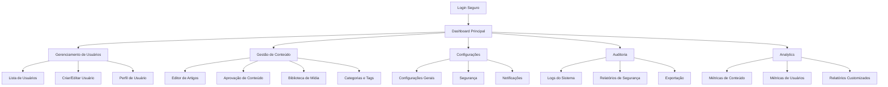

# Documento de Requisitos do Produto - Sistema de Administração UbaNews

## 1. Visão Geral do Produto

O Sistema de Administração UbaNews é uma plataforma web completa e segura para gerenciamento do portal de notícias, oferecendo controle total sobre usuários, conteúdo, configurações e monitoramento do sistema. A solução permite que administradores gerenciem eficientemente todas as operações do portal, desde a criação de usuários até a análise de métricas em tempo real.

O sistema resolve problemas críticos de gestão de conteúdo jornalístico, controle de acesso multi-nível e monitoramento de performance, sendo utilizado por administradores, editores e gestores de conteúdo que precisam de ferramentas robustas para manter a qualidade e segurança do portal de notícias.

O objetivo é estabelecer o UbaNews como referência em portais de notícias locais, com um sistema administrativo que garanta eficiência operacional, segurança de dados e escalabilidade para crescimento futuro.

## 2. Funcionalidades Principais

### 2.1 Perfis de Usuário

| Perfil | Método de Registro | Permissões Principais |
|--------|-------------------|----------------------|
| Super Admin | Criação manual pelo sistema | Acesso total, gerenciamento de admins, configurações críticas |
| Admin | Criação por Super Admin | Gerenciamento de usuários, conteúdo, configurações gerais |
| Editor | Criação por Admin/Super Admin | Aprovação de conteúdo, moderação, relatórios editoriais |
| Colunista | Criação por Editor/Admin | Criação de artigos, gestão de próprio conteúdo |
| Repórter | Criação por Editor/Admin | Criação de notícias básicas, upload de mídia |

### 2.2 Módulos Funcionais

Nosso sistema de administração consiste nas seguintes páginas principais:

1. **Dashboard Principal**: painel de controle com métricas em tempo real, gráficos de performance, feed de atividades recentes e ações rápidas.

2. **Gerenciamento de Usuários**: listagem completa de usuários, formulários de criação/edição, controle de permissões, histórico de atividades e ferramentas de moderação.

3. **Gestão de Conteúdo**: editor de notícias avançado, sistema de aprovação de conteúdo, gerenciamento de categorias e tags, biblioteca de mídia e agendamento de publicações.

4. **Configurações do Sistema**: configurações gerais do portal, políticas de segurança, configurações de notificações, integrações externas e personalização da interface.

5. **Auditoria e Logs**: visualizador de logs de sistema, filtros avançados de auditoria, relatórios de segurança, exportação de dados e monitoramento de atividades suspeitas.

6. **Relatórios e Analytics**: dashboard de métricas detalhadas, relatórios de engajamento, análise de performance de conteúdo, estatísticas de usuários e exportação de relatórios personalizados.

### 2.3 Detalhes das Páginas

| Página | Módulo | Descrição da Funcionalidade |
|--------|--------|-----------------------------|
| Dashboard Principal | Painel de Métricas | Exibir métricas em tempo real (usuários ativos, artigos publicados, visualizações). Gráficos interativos de performance. Feed de atividades recentes do sistema. |
| Dashboard Principal | Ações Rápidas | Botões para criação rápida de conteúdo, aprovação pendente, moderação urgente. Notificações de sistema e alertas importantes. |
| Dashboard Principal | Status do Sistema | Monitoramento de uptime, uso de recursos, status de serviços externos. Indicadores de saúde do sistema e alertas de manutenção. |
| Gerenciamento de Usuários | Lista de Usuários | Tabela paginada com filtros avançados (role, status, data). Busca por nome/email. Ações em lote (ativar/desativar, exportar). |
| Gerenciamento de Usuários | Formulário de Usuário | Criação/edição com validação em tempo real. Seleção de roles e permissões. Upload de avatar e dados de perfil. |
| Gerenciamento de Usuários | Perfil de Usuário | Visualização detalhada do perfil. Histórico de atividades. Configurações de segurança (2FA, sessões ativas). |
| Gestão de Conteúdo | Editor de Artigos | Editor WYSIWYG avançado com preview. Upload de imagens e mídia. Configurações de SEO e meta tags. |
| Gestão de Conteúdo | Aprovação de Conteúdo | Workflow de aprovação com comentários. Comparação de versões. Sistema de notificações para autores. |
| Gestão de Conteúdo | Biblioteca de Mídia | Upload múltiplo de arquivos. Organização por pastas. Otimização automática de imagens. Integração com CDN. |
| Configurações | Configurações Gerais | Nome do site, logo, descrição. Configurações de timezone e idioma. Políticas de privacidade e termos. |
| Configurações | Segurança | Políticas de senha, configuração 2FA. Whitelist de IPs. Configurações de sessão e timeout. |
| Configurações | Notificações | Templates de email. Configuração de webhooks. Integração com serviços de push notification. |
| Auditoria | Visualizador de Logs | Tabela filtrada por usuário, ação, data. Detalhes expandidos de cada log. Busca textual em logs. |
| Auditoria | Relatórios de Segurança | Tentativas de login falhadas. Atividades suspeitas. Relatórios de compliance e auditoria. |
| Auditoria | Exportação | Exportar logs em CSV/PDF. Relatórios agendados. Integração com sistemas externos de monitoramento. |
| Analytics | Métricas de Conteúdo | Artigos mais visualizados. Taxa de engajamento. Performance por categoria e autor. |
| Analytics | Métricas de Usuários | Usuários ativos, novos registros. Comportamento de navegação. Análise de retenção. |
| Analytics | Relatórios Customizados | Criação de relatórios personalizados. Agendamento de envio. Dashboard personalizável. |

## 3. Fluxo Principal de Operações

### Fluxo do Administrador
O administrador acessa o sistema através de login seguro com 2FA, visualiza o dashboard com métricas atualizadas, gerencia usuários criando/editando perfis e permissões, monitora conteúdo aprovando/rejeitando publicações, configura parâmetros do sistema e políticas de segurança, e analisa logs de auditoria para garantir conformidade e segurança.

### Fluxo do Editor
O editor faz login no sistema, acessa o painel de conteúdo pendente, revisa artigos submetidos pelos repórteres e colunistas, aprova ou solicita correções com comentários detalhados, gerencia categorias e tags do conteúdo, programa publicações para horários estratégicos, e monitora métricas de engajamento do conteúdo publicado.

### Fluxo do Criador de Conteúdo (Colunista/Repórter)
O criador de conteúdo acessa sua área restrita, cria novos artigos usando o editor avançado, faz upload de imagens e mídia relacionada, configura SEO e meta tags, submete conteúdo para aprovação editorial, acompanha status de aprovação e comentários dos editores, e visualiza métricas de performance de seus artigos publicados.

## 4. Design da Interface do Usuário

### 4.1 Estilo de Design

- **Cores Primárias**: Azul escuro (#1e40af) para elementos principais, azul claro (#3b82f6) para ações secundárias
- **Cores Secundárias**: Cinza neutro (#6b7280) para textos, verde (#10b981) para sucessos, vermelho (#ef4444) para alertas
- **Estilo de Botões**: Botões arredondados com sombra sutil, efeitos hover suaves, estados disabled claros
- **Tipografia**: Inter como fonte principal (14px-16px para textos), títulos em Poppins (18px-32px), código em JetBrains Mono
- **Layout**: Design baseado em cards com espaçamento generoso, navegação lateral fixa, breadcrumbs para orientação
- **Ícones**: Lucide React para consistência, ícones outline para ações, filled para estados ativos

### 4.2 Visão Geral do Design das Páginas

| Página | Módulo | Elementos de UI |
|--------|--------|----------------|
| Dashboard Principal | Painel de Métricas | Cards com métricas destacadas usando cores de status. Gráficos em linha e barras com animações suaves. Grid responsivo 2x2 em desktop, stack em mobile. |
| Dashboard Principal | Feed de Atividades | Lista vertical com avatares de usuários. Timestamps relativos. Ícones coloridos por tipo de ação. Scroll infinito para histórico. |
| Dashboard Principal | Ações Rápidas | Botões grandes com ícones expressivos. Cores diferenciadas por prioridade. Tooltips explicativos. Layout em grid adaptativo. |
| Gerenciamento de Usuários | Lista de Usuários | Tabela responsiva com filtros no topo. Badges coloridos para status e roles. Ações inline (editar, desativar). Paginação numerada. |
| Gerenciamento de Usuários | Formulário de Usuário | Layout em duas colunas. Validação em tempo real com feedback visual. Upload de avatar com preview. Seletor de permissões com checkboxes agrupados. |
| Gestão de Conteúdo | Editor de Artigos | Interface split-screen (editor/preview). Toolbar flutuante com formatação. Sidebar com configurações de SEO. Autosave com indicador visual. |
| Gestão de Conteúdo | Biblioteca de Mídia | Grid de thumbnails com overlay de informações. Drag & drop para upload. Filtros por tipo de arquivo. Modal para detalhes e edição. |
| Configurações | Painel de Configurações | Navegação em tabs laterais. Formulários organizados em seções. Botões de ação fixos no rodapé. Indicadores de mudanças não salvas. |
| Auditoria | Visualizador de Logs | Tabela com densidade compacta. Filtros avançados em sidebar colapsável. Detalhes expandíveis por linha. Códigos de cor por tipo de ação. |
| Analytics | Dashboard de Métricas | Gráficos interativos com drill-down. Seletores de período no topo. Cards de KPIs com tendências. Export buttons para relatórios. |

### 4.3 Responsividade

O sistema é desenvolvido com abordagem desktop-first, garantindo experiência otimizada em telas grandes onde administradores trabalham principalmente. A adaptação mobile inclui navegação colapsável, tabelas com scroll horizontal, formulários em layout vertical e touch-friendly com botões maiores e espaçamento adequado para interação por toque.

## 5. Requisitos Técnicos

### 5.1 Arquitetura de Segurança
- **Autenticação**: JWT tokens com refresh automático, 2FA obrigatório para admins
- **Autorização**: Sistema RBAC (Role-Based Access Control) com permissões granulares
- **Criptografia**: Dados sensíveis criptografados em repouso e em trânsito
- **Auditoria**: Log completo de todas as ações com rastreabilidade
- **Proteção**: Rate limiting, CSRF protection, XSS prevention

### 5.2 Performance e Escalabilidade
- **Cache**: Redis para sessões e dados frequentes
- **CDN**: Distribuição de assets estáticos
- **Lazy Loading**: Carregamento sob demanda de componentes pesados
- **Otimização**: Compressão de imagens, minificação de assets
- **Monitoramento**: Métricas de performance em tempo real

### 5.3 Integração e APIs
- **Supabase**: Backend-as-a-Service para autenticação e banco de dados
- **WebSocket**: Atualizações em tempo real para dashboard
- **REST API**: Endpoints padronizados para todas as operações
- **Webhooks**: Notificações para sistemas externos
- **Export**: APIs para exportação de dados em múltiplos formatos

## 6. Critérios de Aceitação

### 6.1 Funcionalidade
- ✅ Sistema de login com 2FA funcional
- ✅ Dashboard com métricas em tempo real
- ✅ CRUD completo de usuários com validações
- ✅ Editor de conteúdo com preview
- ✅ Sistema de aprovação de workflow
- ✅ Logs de auditoria completos
- ✅ Configurações persistentes
- ✅ Relatórios exportáveis

### 6.2 Segurança
- ✅ Autenticação robusta implementada
- ✅ Controle de acesso por roles
- ✅ Logs de segurança ativos
- ✅ Proteção contra ataques comuns
- ✅ Backup automático de dados
- ✅ Compliance com LGPD

### 6.3 Performance
- ✅ Tempo de carregamento < 3 segundos
- ✅ Interface responsiva em todos os dispositivos
- ✅ Suporte a 100+ usuários simultâneos
- ✅ Uptime > 99.5%
- ✅ Backup e recovery funcionais

### 6.4 Usabilidade
- ✅ Interface intuitiva sem necessidade de treinamento extenso
- ✅ Feedback visual claro para todas as ações
- ✅ Navegação consistente entre páginas
- ✅ Mensagens de erro informativas
- ✅ Acessibilidade básica implementada

## 7. Cronograma de Entrega

### Fase 1 - Fundação (2 semanas)
- Setup da infraestrutura e segurança
- Sistema de autenticação completo
- Layout base e navegação
- Testes de segurança básicos

### Fase 2 - Core Features (2 semanas)
- Dashboard principal com métricas
- Gerenciamento de usuários completo
- Sistema de auditoria básico
- Configurações essenciais

### Fase 3 - Gestão de Conteúdo (2 semanas)
- Editor de artigos avançado
- Sistema de aprovação
- Biblioteca de mídia
- Categorização e tags

### Fase 4 - Analytics e Relatórios (2 semanas)
- Dashboard de métricas avançadas
- Sistema de relatórios
- Exportação de dados
- Integração com analytics

### Fase 5 - Polimento e Deploy (2 semanas)
- Testes completos de sistema
- Otimizações de performance
- Documentação final
- Deploy em produção

## 8. Riscos e Mitigações

### 8.1 Riscos Técnicos
- **Risco**: Problemas de performance com grande volume de dados
- **Mitigação**: Implementar paginação, cache e otimizações de query

- **Risco**: Vulnerabilidades de segurança
- **Mitigação**: Auditorias regulares, testes de penetração, atualizações constantes

### 8.2 Riscos de Negócio
- **Risco**: Resistência dos usuários à nova interface
- **Mitigação**: Treinamento adequado, migração gradual, feedback contínuo

- **Risco**: Indisponibilidade durante migração
- **Mitigação**: Deploy em horários de baixo tráfego, rollback plan preparado

## 9. Métricas de Sucesso

### 9.1 Métricas Técnicas
- **Uptime**: > 99.5%
- **Tempo de Resposta**: < 2 segundos para 95% das requisições
- **Taxa de Erro**: < 0.1%
- **Cobertura de Testes**: > 80%

### 9.2 Métricas de Usuário
- **Adoção**: 100% dos administradores usando o sistema em 30 dias
- **Satisfação**: Score > 4.5/5 em pesquisa de usabilidade
- **Produtividade**: Redução de 50% no tempo para tarefas administrativas
- **Suporte**: Redução de 70% em tickets relacionados ao sistema admin

## 10. Documentação e Treinamento

### 10.1 Documentação Técnica
- Manual de instalação e configuração
- Documentação de APIs
- Guia de troubleshooting
- Procedimentos de backup e recovery

### 10.2 Documentação de Usuário
- Manual do administrador
- Guia do editor
- Tutoriais em vídeo
- FAQ e base de conhecimento

### 10.3 Treinamento
- Sessões de treinamento para administradores
- Workshops para editores
- Suporte durante período de transição
- Canal de comunicação para dúvidas

---

**Aprovação**: Este documento deve ser aprovado pela equipe de desenvolvimento, stakeholders do negócio e equipe de segurança antes do início da implementação.

**Revisões**: Revisões semanais de progresso com ajustes conforme necessário baseados em feedback e descobertas durante o desenvolvimento.