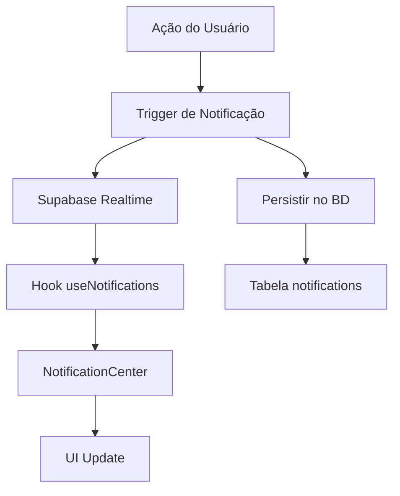
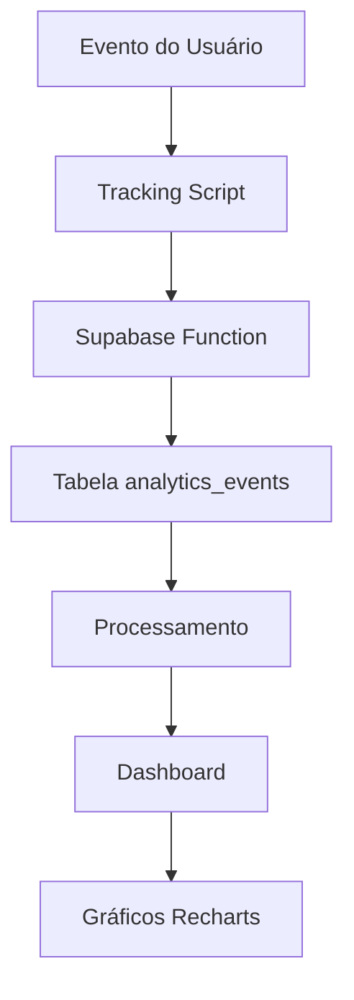
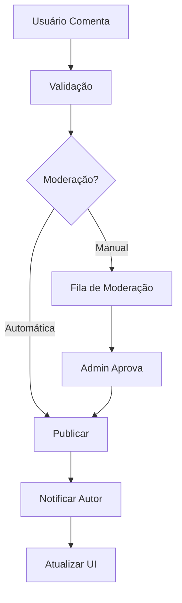

# Roadmap Fase 2 - UbaNews
## Sistema de Notícias Avançado

---

## 1. Visão Geral da Fase 2

### 🎯 **Objetivo Principal**
Transformar o UbaNews de um sistema administrativo robusto em uma plataforma completa de notícias com funcionalidades avançadas de comunicação, analytics e engajamento.

### 📊 **Status Atual**
- ✅ **Fase 1 Concluída**: Sistema administrativo, aprovações, auditoria e editor avançado
- 🎯 **Fase 2 Iniciando**: Notificações, analytics e comentários
- 📈 **Progresso Geral**: 70% do projeto base concluído

---

## 2. Funcionalidades Prioritárias da Fase 2

### 🔴 **PRIORIDADE CRÍTICA (Semanas 1-2)**

#### 2.1 Sistema de Notificações em Tempo Real
**Prazo**: 1-2 semanas  
**Impacto**: Alto - Melhora significativa na comunicação editorial

**Funcionalidades**:
- Notificações push em tempo real
- Centro de notificações unificado
- Tipos de notificação:
  - Aprovação/rejeição de notícias
  - Novos comentários
  - Menções em comentários
  - Deadlines próximos
  - Atualizações do sistema

**Implementação Técnica**:
```typescript
// Estrutura da tabela notifications
CREATE TABLE notifications (
  id UUID PRIMARY KEY DEFAULT gen_random_uuid(),
  user_id UUID REFERENCES admin_users(id),
  type VARCHAR(50) NOT NULL,
  title VARCHAR(255) NOT NULL,
  message TEXT,
  data JSONB,
  read_at TIMESTAMP,
  created_at TIMESTAMP DEFAULT NOW()
);

// Hook para notificações
const useNotifications = () => {
  const [notifications, setNotifications] = useState([]);
  const [unreadCount, setUnreadCount] = useState(0);
  
  // Supabase Realtime subscription
  // Mark as read functionality
  // Push notification integration
};
```

**Arquivos a criar**:
- `src/hooks/useNotifications.ts`
- `src/components/NotificationCenter.tsx`
- `src/components/NotificationBell.tsx`
- `supabase/migrations/create_notifications.sql`

---

### 🟠 **PRIORIDADE ALTA (Semanas 2-4)**

#### 2.2 Analytics Avançadas e Dashboard Interativo
**Prazo**: 2-3 semanas  
**Impacto**: Alto - Decisões baseadas em dados

**Funcionalidades**:
- Dashboard com gráficos interativos
- Métricas de performance:
  - Visualizações por notícia
  - Tempo de leitura médio
  - Taxa de engajamento
  - Performance por categoria
  - Análise de tendências
- Relatórios exportáveis (PDF/Excel)
- Comparativos temporais
- Alertas de performance

**Implementação Técnica**:
```typescript
// Componente de Analytics
interface AnalyticsData {
  pageViews: number;
  uniqueVisitors: number;
  avgReadTime: number;
  bounceRate: number;
  topArticles: Article[];
  categoryPerformance: CategoryStats[];
}

const AdvancedAnalytics: React.FC = () => {
  // Recharts para gráficos
  // Filtros de data
  // Exportação de relatórios
  // Comparativos
};
```

**Dependências necessárias**:
```json
{
  "recharts": "^2.8.0",
  "jspdf": "^2.5.1",
  "xlsx": "^0.18.5",
  "date-fns": "^2.30.0"
}
```

**Arquivos a criar/modificar**:
- `src/admin/pages/AdvancedAnalytics.tsx`
- `src/hooks/useAnalytics.ts`
- `src/components/charts/` (vários componentes)
- `src/utils/reportExport.ts`

#### 2.3 Sistema de Comentários Públicos
**Prazo**: 2-3 semanas  
**Impacto**: Médio-Alto - Engajamento dos leitores

**Funcionalidades**:
- Comentários aninhados (threads)
- Sistema de moderação:
  - Aprovação automática/manual
  - Filtro de spam
  - Blacklist de palavras
- Notificações para autores
- Sistema de likes/dislikes
- Perfis de comentaristas
- Integração com redes sociais

**Implementação Técnica**:
```sql
-- Tabela de comentários
CREATE TABLE comments (
  id UUID PRIMARY KEY DEFAULT gen_random_uuid(),
  news_id UUID REFERENCES admin_news(id),
  parent_id UUID REFERENCES comments(id),
  author_name VARCHAR(100) NOT NULL,
  author_email VARCHAR(255) NOT NULL,
  content TEXT NOT NULL,
  status VARCHAR(20) DEFAULT 'pending',
  likes_count INTEGER DEFAULT 0,
  dislikes_count INTEGER DEFAULT 0,
  ip_address INET,
  user_agent TEXT,
  created_at TIMESTAMP DEFAULT NOW()
);
```

**Arquivos a criar**:
- `src/components/Comments/CommentSection.tsx`
- `src/components/Comments/CommentForm.tsx`
- `src/components/Comments/CommentThread.tsx`
- `src/admin/pages/CommentModeration.tsx`
- `src/hooks/useComments.ts`
- `supabase/migrations/create_comments.sql`

---

### 🟡 **PRIORIDADE MÉDIA (Semanas 4-6)**

#### 2.4 SEO Avançado e Otimização
**Prazo**: 1-2 semanas  
**Impacto**: Médio - Visibilidade online

**Funcionalidades**:
- Meta tags dinâmicas por notícia
- Sitemap XML automático
- Schema.org markup
- Open Graph tags otimizadas
- Twitter Cards
- Canonical URLs
- Breadcrumbs estruturados

**Implementação**:
```typescript
// Hook para SEO
const useSEO = (article: Article) => {
  useEffect(() => {
    // Dynamic meta tags
    document.title = article.title;
    updateMetaTag('description', article.excerpt);
    updateMetaTag('og:title', article.title);
    updateMetaTag('og:image', article.featured_image);
    // Schema.org JSON-LD
  }, [article]);
};
```

#### 2.5 Sistema de Newsletter
**Prazo**: 1-2 semanas  
**Impacto**: Médio - Retenção de audiência

**Funcionalidades**:
- Cadastro de subscribers
- Templates de email responsivos
- Segmentação de audiência
- Automação de envios
- Métricas de email (open rate, click rate)
- Integração com Mailchimp/SendGrid

---

## 3. Cronograma Detalhado

### **Semana 1: Notificações em Tempo Real**
**Dias 1-2**: Configuração do Supabase Realtime
- Habilitar Realtime no projeto
- Criar tabela `notifications`
- Configurar políticas RLS

**Dias 3-4**: Desenvolvimento do sistema
- Hook `useNotifications`
- Componente `NotificationCenter`
- Integração com sistema de aprovações

**Dias 5-7**: Testes e refinamentos
- Testes de notificações em tempo real
- UI/UX do centro de notificações
- Integração com componentes existentes

### **Semana 2: Analytics Avançadas - Parte 1**
**Dias 1-3**: Estrutura base
- Instalação do Recharts
- Componentes de gráficos básicos
- Hook `useAnalytics`

**Dias 4-7**: Dashboard interativo
- Gráficos de performance
- Filtros de data
- Métricas em tempo real

### **Semana 3: Analytics Avançadas - Parte 2**
**Dias 1-4**: Funcionalidades avançadas
- Relatórios exportáveis
- Comparativos temporais
- Alertas de performance

**Dias 5-7**: Sistema de comentários - Estrutura
- Tabela `comments`
- Componentes básicos
- Sistema de moderação

### **Semana 4: Sistema de Comentários Completo**
**Dias 1-4**: Funcionalidades principais
- Comentários aninhados
- Sistema de likes
- Notificações para autores

**Dias 5-7**: Moderação avançada
- Interface administrativa
- Filtros de spam
- Blacklist de palavras

### **Semana 5-6: SEO e Newsletter**
**Semana 5**: SEO avançado
- Meta tags dinâmicas
- Sitemap automático
- Schema.org markup

**Semana 6**: Sistema de newsletter
- Cadastro de subscribers
- Templates de email
- Automação de envios

---

## 4. Especificações Técnicas Detalhadas

### 4.1 Arquitetura de Notificações



### 4.2 Fluxo de Analytics



### 4.3 Sistema de Comentários



---

## 5. Testes e Qualidade

### 5.1 Estratégia de Testes
- **Testes Unitários**: Jest + React Testing Library
- **Testes de Integração**: Cypress
- **Testes de Performance**: Lighthouse CI
- **Testes de Realtime**: Supabase Test Suite

### 5.2 Métricas de Qualidade
- Cobertura de testes > 80%
- Performance Score > 90
- Accessibility Score > 95
- SEO Score > 90

---

## 6. Riscos e Mitigações

### 6.1 Riscos Técnicos
**Risco**: Sobrecarga do Supabase Realtime
**Mitigação**: Implementar throttling e batching de notificações

**Risco**: Performance com muitos comentários
**Mitigação**: Paginação e lazy loading

**Risco**: Spam em comentários
**Mitigação**: Captcha, rate limiting e filtros automáticos

### 6.2 Riscos de Prazo
**Risco**: Complexidade subestimada
**Mitigação**: Buffer de 20% no cronograma

**Risco**: Dependências externas
**Mitigação**: Fallbacks e alternativas preparadas

---

## 7. Critérios de Sucesso

### 7.1 Métricas Técnicas
- [ ] Notificações entregues em < 1 segundo
- [ ] Dashboard carrega em < 3 segundos
- [ ] Comentários processados em < 500ms
- [ ] 99.9% uptime do sistema

### 7.2 Métricas de Negócio
- [ ] 50% aumento no engajamento editorial
- [ ] 30% melhoria na eficiência de moderação
- [ ] 25% aumento no tempo de permanência
- [ ] 40% melhoria nas métricas de SEO

---

## 8. Próximos Passos Imediatos

### 🚀 **Ações para Hoje**
1. **Configurar Supabase Realtime**
   ```sql
   -- Habilitar Realtime no projeto
   ALTER PUBLICATION supabase_realtime ADD TABLE notifications;
   ```

2. **Instalar dependências**
   ```bash
   npm install recharts jspdf xlsx date-fns
   ```

3. **Criar estrutura de pastas**
   ```bash
   mkdir -p src/components/notifications
   mkdir -p src/components/analytics
   mkdir -p src/components/comments
   ```

### 📋 **Checklist da Primeira Sprint**
- [ ] Configurar Supabase Realtime
- [ ] Criar tabela `notifications`
- [ ] Implementar hook `useNotifications`
- [ ] Desenvolver `NotificationCenter`
- [ ] Integrar com sistema de aprovações
- [ ] Testes básicos de notificações

---

## 9. Conclusão

A Fase 2 do UbaNews focará em transformar a plataforma em um sistema completo e interativo. Com as funcionalidades críticas já implementadas na Fase 1, agora podemos nos concentrar em:

1. **Comunicação eficiente** através de notificações em tempo real
2. **Decisões baseadas em dados** com analytics avançadas
3. **Engajamento da audiência** através de comentários
4. **Visibilidade online** com SEO otimizado

O cronograma é ambicioso mas realista, considerando a sólida base já estabelecida. O foco será na qualidade e na experiência do usuário, mantendo a performance e segurança como prioridades.

**Status**: 🚀 Pronto para iniciar  
**Duração estimada**: 6 semanas  
**Próxima revisão**: Após Sprint 1 (Semana 1)