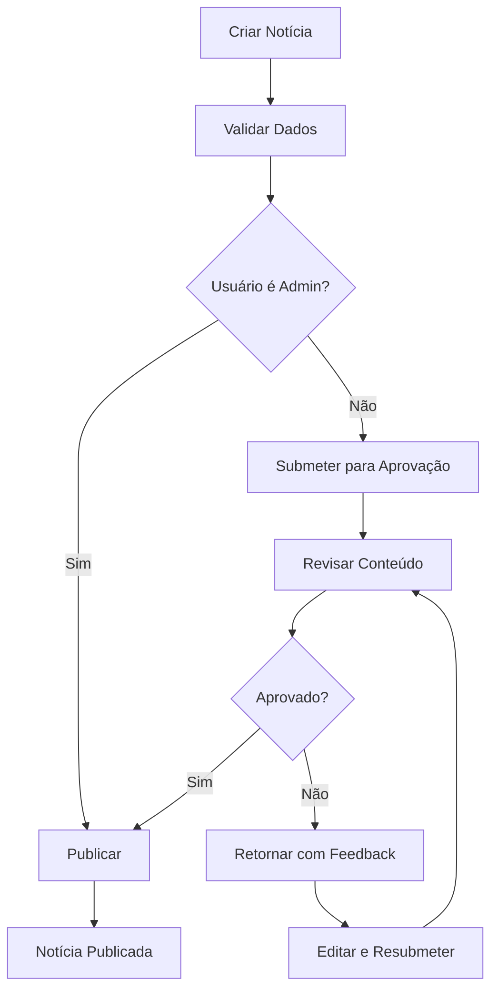

# Sistema de Administração de Notícias - UbaNews

## 1. Visão Geral do Produto

O Sistema de Administração de Notícias é uma plataforma exclusiva para administradores e colunistas autorizados do portal UbaNews, permitindo o gerenciamento completo do conteúdo jornalístico. O sistema oferece funcionalidades avançadas de criação, edição, publicação e arquivamento de notícias, com interface intuitiva e recursos de segurança robustos.

* **Objetivo Principal**: Centralizar o gerenciamento de conteúdo jornalístico com controle de acesso e auditoria completa

* **Público-Alvo**: Administradores do portal e colunistas autorizados

* **Valor de Mercado**: Aumentar a eficiência editorial e garantir a qualidade do conteúdo publicado

## 2. Funcionalidades Principais

### 2.1 Perfis de Usuário

| Perfil        | Método de Acesso                      | Permissões Principais                                                           |
| ------------- | ------------------------------------- | ------------------------------------------------------------------------------- |
| Administrador | Login com credenciais + 2FA           | Acesso completo: criar, editar, excluir, publicar, arquivar, gerenciar usuários |
| Colunista     | Convite por administrador + aprovação | Criar e editar próprias notícias, submeter para aprovação                       |
| Editor-Chefe  | Promoção por administrador            | Aprovar/rejeitar notícias, editar conteúdo de terceiros, publicar               |

### 2.2 Módulos do Sistema

O sistema de administração consiste nas seguintes páginas principais:

1. **Dashboard Administrativo**: painel de controle, estatísticas de conteúdo, atividades recentes
2. **Gerenciador de Notícias**: listagem completa, filtros avançados, ações em lote
3. **Editor de Notícias**: formulário de criação/edição, preview em tempo real, validação
4. **Sistema de Aprovação**: workflow de publicação, comentários de revisão
5. **Gerenciamento de Usuários**: controle de acesso, perfis, permissões
6. **Auditoria e Logs**: histórico de ações, relatórios de atividade
7. **Configurações**: preferências do sistema, templates, categorias

### 2.3 Detalhamento das Funcionalidades

| Página      | Módulo                  | Descrição das Funcionalidades                                                                       |
| ----------- | ----------------------- | --------------------------------------------------------------------------------------------------- |
| Dashboard   | Painel Principal        | Exibir estatísticas de conteúdo, gráficos de performance, notificações importantes, atalhos rápidos |
| Dashboard   | Atividades Recentes     | Listar últimas ações realizadas, notícias pendentes, alertas do sistema                             |
| Gerenciador | Lista de Notícias       | Exibir todas as notícias com paginação, ordenação por data/status/autor, busca avançada             |
| Gerenciador | Filtros Avançados       | Filtrar por status (rascunho/publicado/arquivado), categoria, autor, período, tags                  |
| Gerenciador | Ações em Lote           | Publicar/arquivar múltiplas notícias, alterar categoria, excluir selecionadas                       |
| Editor      | Formulário de Criação   | Campos obrigatórios (título, conteúdo, categoria, tags), upload de imagens, SEO                     |
| Editor      | Validação de Dados      | Verificar campos obrigatórios, formato de data, tamanho de imagens, duplicatas                      |
| Editor      | Preview em Tempo Real   | Visualizar como a notícia aparecerá no site, modo mobile/desktop                                    |
| Aprovação   | Workflow de Publicação  | Submeter para revisão, aprovar/rejeitar, comentários de feedback                                    |
| Aprovação   | Histórico de Versões    | Controlar alterações, comparar versões, restaurar versões anteriores                                |
| Usuários    | Gerenciamento de Acesso | Criar/editar usuários, definir permissões, ativar/desativar contas                                  |
| Usuários    | Controle de Sessões     | Monitorar sessões ativas, forçar logout, histórico de acessos                                       |
| Auditoria   | Sistema de Logs         | Registrar todas as ações (criar, editar, excluir, publicar), exportar relatórios                    |
| Auditoria   | Relatórios de Atividade | Gerar relatórios por período, usuário, tipo de ação, estatísticas                                   |

## 3. Fluxos de Trabalho Principais

### Fluxo do Administrador

1. Login com autenticação dupla → Dashboard com visão geral
2. Acessar Gerenciador de Notícias → Visualizar todas as notícias
3. Criar nova notícia → Preencher formulário → Publicar diretamente
4. Gerenciar usuários → Definir permissões → Monitorar atividades
5. Revisar logs de auditoria → Gerar relatórios → Tomar ações corretivas

### Fluxo do Colunista

1. Login com credenciais → Dashboard personalizado
2. Criar nova notícia → Preencher formulário → Submeter para aprovação
3. Editar notícias próprias → Visualizar status de aprovação
4. Receber feedback → Fazer correções → Resubmeter

### Fluxo de Publicação

## 4. Design da Interface

### 4.1 Estilo Visual

* **Cores Primárias**: Azul corporativo (#2563eb), Verde sucesso (#16a34a), Vermelho alerta (#dc2626)

* **Cores Secundárias**: Cinza neutro (#64748b), Branco (#ffffff), Preto texto (#0f172a)

* **Estilo de Botões**: Arredondados com sombra sutil, estados hover e focus bem definidos

* **Tipografia**: Inter para interface (14px-16px), Merriweather para conteúdo (16px-18px)

* **Layout**: Sidebar fixa à esquerda, conteúdo principal responsivo, cards para organização

* **Ícones**: Lucide React com estilo minimalista e consistente

### 4.2 Componentes da Interface

| Página      | Módulo               | Elementos de UI                                                                  |
| ----------- | -------------------- | -------------------------------------------------------------------------------- |
| Dashboard   | Painel Principal     | Cards com estatísticas, gráficos coloridos, layout em grid 3x2, animações suaves |
| Dashboard   | Sidebar de Navegação | Menu vertical fixo, ícones + texto, indicadores de estado ativo                  |
| Gerenciador | Tabela de Notícias   | Tabela responsiva, paginação inferior, filtros no topo, ações por linha          |
| Gerenciador | Filtros Avançados    | Dropdowns múltiplos, date picker, tags selecionáveis, botão limpar filtros       |
| Editor      | Formulário Principal | Campos organizados em seções, editor rich text, upload drag-and-drop             |
| Editor      | Preview              | Modal fullscreen, toggle mobile/desktop, botões de ação flutuantes               |
| Aprovação   | Lista de Pendências  | Cards com preview, botões aprovar/rejeitar, campo de comentários                 |
| Usuários    | Tabela de Usuários   | Avatar + nome, badges de status, ações inline, modal de edição                   |
| Auditoria   | Timeline de Logs     | Lista cronológica, filtros por tipo, exportação CSV/PDF                          |

### 4.3 Responsividade

* **Desktop-first** com adaptação mobile completa

* **Breakpoints**: Mobile (<768px), Tablet (768px-1024px), Desktop (>1024px)

* **Sidebar**: Colapsa em hambúrguer menu no mobile

* **Tabelas**: Transformam em cards empilháveis no mobile

* **Formulários**: Campos em coluna única no mobile, duas colunas no desktop

* **Touch**: Botões com área mínima de 44px, gestos de swipe para ações

## 5. Requisitos de Segurança

### 5.1 Autenticação e Autorização

* **Autenticação dupla (2FA)** obrigatória para administradores

* **JWT tokens** com expiração de 8 horas e refresh automático

* **Controle de sessões** com limite de dispositivos simultâneos

* **Bloqueio automático** após 5 tentativas de login incorretas

* **Senhas seguras** com política mínima (8 caracteres, maiúscula, número, símbolo)

### 5.2 Validação e Sanitização

* **Validação client-side** com Zod para todos os formulários

* **Sanitização server-side** para prevenir XSS e SQL injection

* **Upload seguro** com verificação de tipo MIME e tamanho máximo

* **Rate limiting** para APIs (100 requests/minuto por usuário)

* **CSRF protection** com tokens únicos por sessão

### 5.3 Sistema de Auditoria

* **Log completo** de todas as ações (criar, editar, excluir, publicar)

* **Rastreamento de IP** e user-agent para cada ação

* **Retenção de logs** por 2 anos com backup automático

* **Alertas automáticos** para ações suspeitas ou críticas

* **Relatórios de conformidade** exportáveis para auditoria externa

## 6. Acessibilidade

### 6.1 Padrões WCAG 2.1 AA

* **Contraste mínimo** de 4.5:1 para texto normal, 3:1 para texto grande

* **Navegação por teclado** completa com indicadores de foco visíveis

* **Screen readers** com ARIA labels e landmarks apropriados

* **Texto alternativo** obrigatório para todas as imagens

* **Formulários** com labels associados e mensagens de erro claras

### 6.2 Usabilidade Inclusiva

* **Tamanhos de fonte** ajustáveis (14px-20px)

* **Modo alto contraste** disponível

* **Atalhos de teclado** para ações frequentes

* **Tempo de sessão** extensível para usuários com necessidades especiais

* **Linguagem simples** em todas as mensagens e instruções

## 7. Tecnologias Recomendadas

### 7.1 Frontend

* **React 18** com TypeScript para type safety

* **Tailwind CSS** para estilização responsiva

* **React Hook Form** + Zod para validação de formulários

* **TanStack Query** para gerenciamento de estado servidor

* **React Router** para navegação e rotas protegidas

### 7.2 Backend

* **Supabase** para autenticação, banco de dados e storage

* **PostgreSQL** com Row Level Security (RLS)

* **Supabase Auth** com 2FA e controle de sessões

* **Supabase Storage** para upload seguro de imagens

* **Edge Functions** para lógica de negócio complexa

### 7.3 Segurança e Monitoramento

* **Supabase RLS** para controle de acesso granular

* **Supabase Realtime** para notificações em tempo real

* **Sentry** para monitoramento de erros

* **LogRocket** para análise de sessões de usuário

* **Vercel Analytics** para métricas de performance

## 8. Cronograma de Implementação

### Fase 1 (2-3 semanas): Fundação

* Configurar autenticação e autorização

* Criar estrutura de banco de dados

* Implementar sistema de logs básico

* Desenvolver layout base e navegação

### Fase 2 (3-4 semanas): CRUD de Notícias

* Implementar criação e edição de notícias

* Desenvolver sistema de validação

* Criar interface de listagem e filtros

* Implementar upload de imagens

### Fase 3 (2-3 semanas): Workflow de Aprovação

* Desenvolver sistema de aprovação

* Implementar notificações em tempo real

* Criar histórico de versões

* Adicionar comentários de revisão

### Fase 4 (1-2 semanas): Finalização

* Implementar relatórios de auditoria

* Otimizar performance e acessibilidade

* Realizar testes de segurança

* Documentar sistema e treinar usuários

## 9. Métricas de Sucesso

* **Tempo de criação de notícia**: Reduzir de 15 para 8 minutos

* **Taxa de erros de publicação**: Manter abaixo de 2%

* **Satisfação do usuário**: Atingir score NPS > 70

* **Tempo de aprovação**: Reduzir de 2 horas para 30 minutos

* **Conformidade de segurança**: 100% das ações auditadas

* **Acessibilidade**: Atingir score WCAG AA completo

