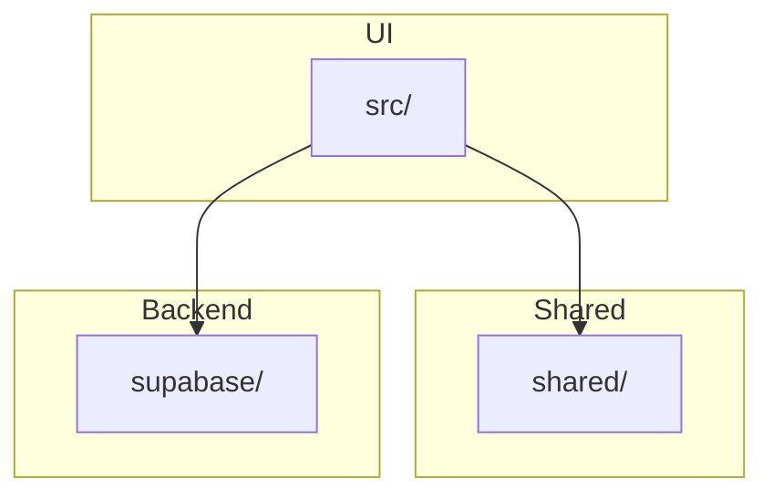
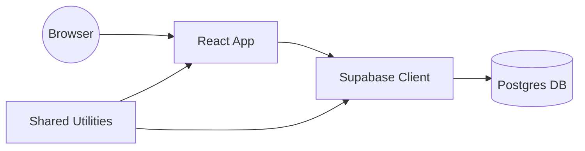

# Architecture

This project is organized into a few key modules:

The `src/` directory contains the React application, `shared/` holds utilities and shared code, and `supabase/` defines database types and migrations.

On a high level, the runtime architecture looks like this:

User interactions go through the React application, which uses the Supabase client to communicate with the hosted Postgres database. Utility functions in `shared/` are imported by both the application and the client code to keep logic consistent across the stack.
