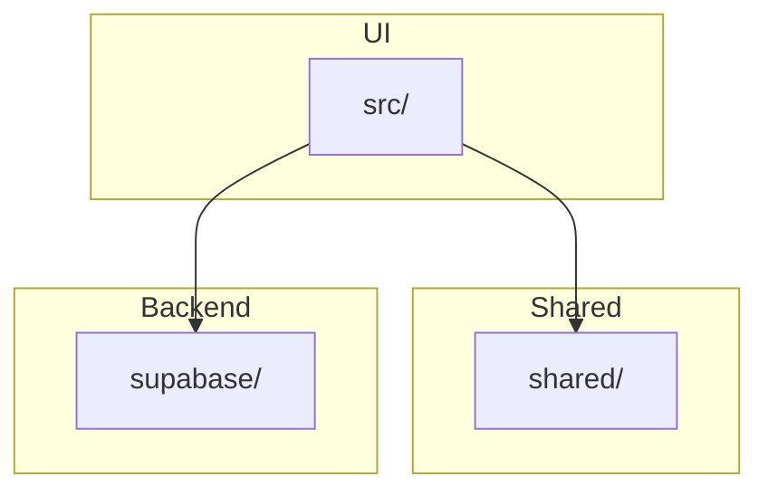

# Architecture

This project is organized into a few key modules:

The `src/` directory contains the React application, `shared/` holds utilities and shared code, and `supabase/` defines database types and migrations.

